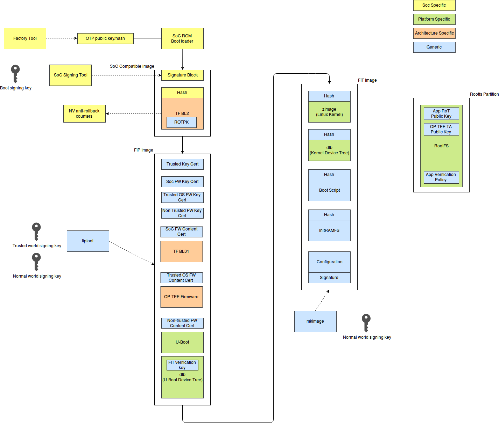
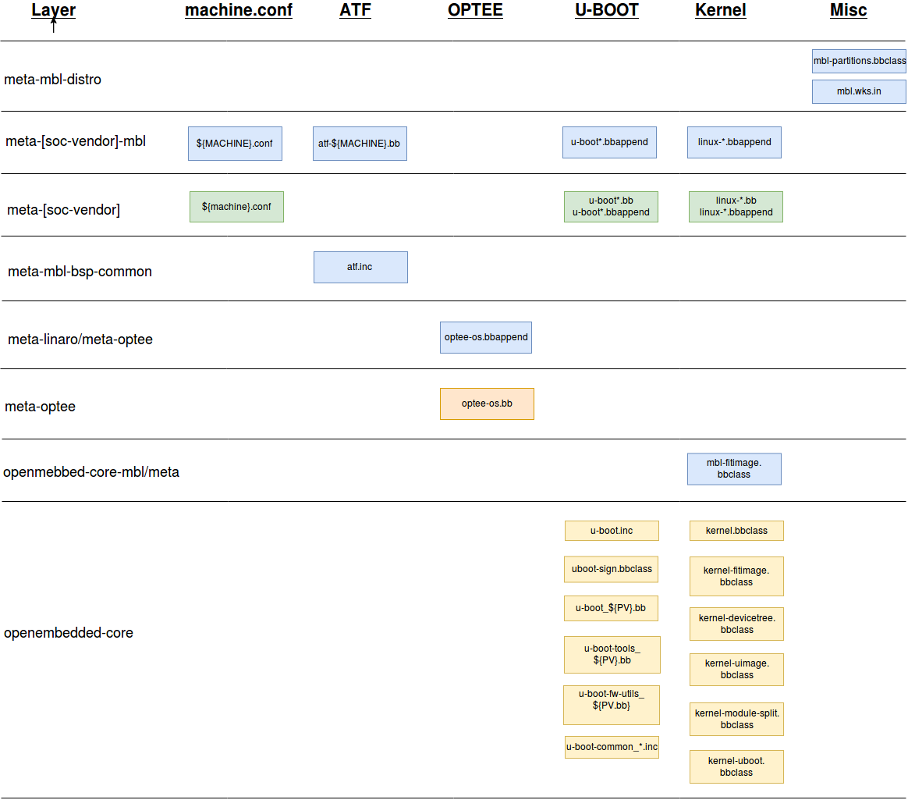
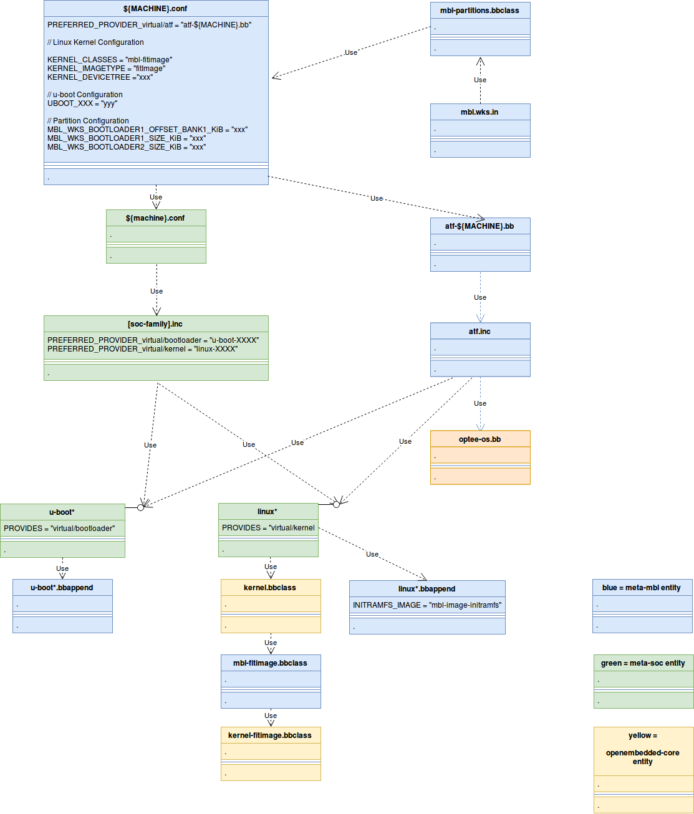
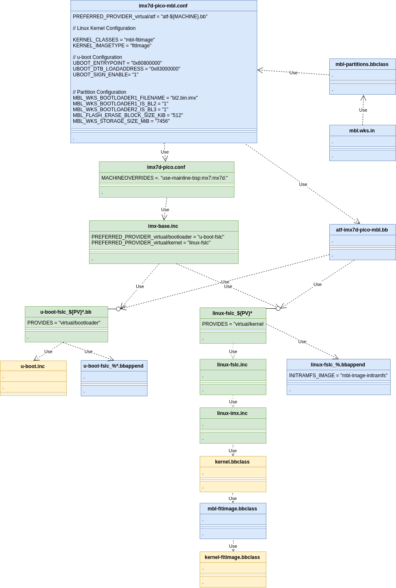

<h1 id="bsp-port">Mbed Linux OS BSP porting guide</h1>

This document details how to port an existing Arm Cortex-A board support package (BSP) to Mbed Linux OS (MBL), enabling the platform's software stack for security, connection to Pelion Device Management and firmware update.

Porting a BSP centers on configuring the secure boot software components, so the correct artifacts appear on the right flash partitions for update:

- **Trusted Firmware for Cortex-A (TF-A)**: Use Trusted Firmware in v7A AArch32 and v8A AArch64 secure boot processes. TF-A artifacts include the second-stage bootloader BL2 and the Firmware Image Package (FIP) containing third-stage bootloaders BL3x and certificates.
- **Open Platform Trusted Execution Environment (OP-TEE)**: This is the OS with trusted applications running in the TrustZone secure world and is packaged as BL32 in the FIP image.
- **U-Boot**: U-Boot is the Normal world bootloader for loading a Rich OS. This is packaged as BL33 inside the FIP image.
- **Linux kernel**: The Linux kernel is the Normal world Rich OS kernel. The kernel image is packaged with the device tree binaries and initial RAM file system in a Flattened Image Tree (FIT) image.

This document's structure follows the work process:

- This section introduces this guide, including an overview, porting prerequisites and glossary.
- [System architecture](../develop-mbl/bsp-sys-arch.html) describes the relevant system architecture of AArch32 and AArch64 secure boot flows, partitioning build artifacts between `BL2`, FIP and FIT images and the flash partition layout for updating firmware.
- [Overview of MBL Yocto layers](../develop-mbl/bsp-yocto.html) provides a top-down overview of the Yocto layers in an MBL workspace for BSP development, including a software stack diagram showing how recipes from different layers collaborate.
- [BSP recipe relationships](../develop-mbl/bsp-recipe.html) provides an overview of `${MACHINE}.conf`, ATF, OP-TEE, U-Boot and `linux` recipe relationships using a UML diagram.
- [Machine configuration files](../develop-mbl/bsp-machine-config.html) discusses, in detail, the MBL `${MACHINE}.conf` and community `${machine}.conf` machine configuration files.
- [u-boot*](../develop-mbl/bsp-u-boot.html) discusses the `u-boot*.bb` base recipe and MBL `u-boot*.bbappend` customization.
- [linux*](../develop-mbl/bsp-linux.html) discusses the `linux*.bb` base recipe and MBL `linux*.bbappend` customization.
- [atf-${MACHINE}.bb](../develop-mbl/bsp-atf.html) discusses the `atf-${MACHINE}.bb` recipe for building Arm Trusted Firmware.
- [Example: imx7d-pico-mbl BSP recipe/package relationships](../develop-mbl/bsp-example.html) provides a concrete example for the PICO-PI with IMX7D target of the `${MACHINE}.conf`, ATF, OP-TEE, U-Boot and `linux` recipe inter-relationships using a UML diagram.
- [Summary of BSP porting tasks](../develop-mbl/bsp-tasks.html) summarizes porting tasks.
- [References](../develop-mbl/bsp-refs.html) links to supporting references to this document.

## Prerequisites

MBL uses Yocto, BitBake, `openembedded-core` and third-party layers to compose the development and build workspace.

We recommend reading [Embedded Linux Systems with the Yocto Project][strief-2016] first, then the [Yocto Mega Manual][yocto-mega-manual-latest], as well as the [Yocto Project Board Support Package (BSP) Developer's Guide][yocto-project-board-support-package-bsp-developer-guide-latest].

To port ATF to your target platform, please consult the [ATF porting guide][atf-doc-plat-porting-guide].

To port OP-TEE to your target platform, please consult the [OP-TEE documentation][optee-docs].

## Terminology

This section defines terminology used throughout this document.

**Table 1.2: Acronyms and terminology**

- **REF1:** Term is defined in TF-A fiptool documentation and source code.
- **REF2:** Term is defined in TrustZone documentation.

| Term | Definition |
| --- | ---|
| AP  | Application processor |
| ATF | Arm Trusted Firmware |
| BL | Bootloader |
| BL1 | First-stage bootloader |
| BL2 | Second-stage bootloader. This is based on TF-A running at EL3 when the Memory Management Unit (MMU) is switched off. BL2 loads the FIP image and authenticates FIP content. |
| BL31 | Third-stage bootloader, part one. For example, Secure Monitor running in EL1-SW. This stage enables the MMU. |
| BL32 | Third-stage bootloader, part two. For example, OP-TEE, the secure world OS. This typically switches to Normal world. |
| BL33 | Third-stage bootloader, part three. For example, U-Boot, the Normal world bootloader. Also referred to as Nontrusted world firmware (NT-FW). |
| DTB | Device tree binary |
| EL | Execution level |
| FIP | Firmware image package. This is a "simple file system" for managing signed bootchain components. |
| FIT | Flattened Image Tree. This is a Linux kernel image container for holding the kernel, kernel DTB and `initramfs`. |
| Linux | The runtime Normal world kernel. |
| MBL | Mbed Linux OS |
| MMU | Memory Management Unit |
| Normal world | The nonsecurity operating mode as defined in Arm reference documentation. |
| NT | Nontrusted |
| NT-FW | Nontrusted Firmware binary (REF1). For example, BL33 U-Boot. Runs at EL2-NW. |
| NT-FW-CERT | Nontrusted Firmware certificate (REF1). For example, U-Boot content certificate. |
| NT-FW-KEY-CERT | Nontrusted Firmware certificate (REF1) |
| NW | Normal world (REF2) |
| OP-TEE | Open Platform Trusted Execution Environment |
| Secure world | The high security operating mode as defined in Arm reference document. |
| SW | Secure world (REF2) |
| SOC-FW | System-On-Chip Firmware binary (REF1) |
| SOC-FW-CERT | System-On-Chip Firmware certificate (REF1) |
| SOC-FW-KEY-CERT | System-On-Chip Firmware key certificate (REF1) |
| ROT | Root of Trust |
| ROTPK | Root of Trust public key |
| ROTPrvK | Root of Trust private key |
| TBBR | Trusted Board boot requirements |
| TBBR-CLIENT | TBBR specification document |
| TB-FW | Trusted Board Firmware binary (REF1) |
| TB-FW-CERT | Trusted Board Firmware certificate (REF1) |
| TB-FW-KEY-CERT | Trusted Board Firmware key certificate (REF1) |
| TF-A | Trusted Firmware for Cortex-A |
| TOS-FW | Trusted OS Firmware binary (REF1) |
| TOS-FW-CERT | Trusted OS Firmware certificate (REF1) |
| TOS-FW-EXTRA1 | Trusted OS Firmware Extra-1 binary (REF1) |
| TOS-FW-EXTRA2 | Trusted OS Firmware Extra-2 binary (REF1) |
| TOS-FW-KEY-CERT | Trusted OS firmware key certificate (REF1) |
| TRUSTED-KEY-CERT | Trusted Key Certificate. Contains the trusted world public key and nontrusted world public key. |
| WIC | Openembedded Image Creator application. |

<h1 id="bsp-sys-arch">System architecture</h1>

A summary of the key BSP system architecture:

- **Security:** Trusted Firmware for Cortex-A provides a generic solution for authenticating software components.
- **Firmware Update:** Pelion Device Management Update service is used to update device firmware. This leads to a flash partition layout where trusted firmware, kernel, root file system and applications are independently updatable.
- **Reuse:** Where possible, suitable existing solutions and software are reused.

## Boot flow

<span class="images"><span><br>A summary form of the secure boot chain flow</span></span>

The image above shows the main entities in the secure bootchain sequence: Soc Boot ROM, Trusted Firmware (TF), OP-TEE, U-Boot and Linux kernel:

1. After the power is turned on, the Soc Boot ROM runs. This is the first-stage bootloader (BL1), which is programmed into the chip during manufacture.
1. BL1 authenticates the second-stage bootloader, which is Trusted Firmware for Cortex-A (TF-A). TF-A supplies:
    - The second-stage bootloader BL2.
    - Part 1 of the third-stage bootloader BL31.
1. BL31 runs OP-TEE, also called BL32.
1. BL31 runs the Normal world bootloader, U-Boot (referred to as BL33).
1. U-Boot runs the Linux kernel.

### AArch32 boot flow

<span class="images"><span>Linaro Connect 2016 Presentation LAS16-402 [slide 16][linaro-connect-las16-402-slides] showing the AArch32 secure boot process.</span></span>

The image above shows the Cortex-v7A AArch32 generic secure boot process, which is the starting point for discussing secure boot on the PICO-PI with IMX7D.

The diagram is divided into four columns, corresponding to the memory type and physical location from which the boot code runs:

1. The first column shows the software components that execute from secure ROM.
1. The second column shows the software components that execute from secure on-chip RAM.
1. The third column shows the software components that execute from secure RAM, which may be on or off the SoC.
1. The fourth column shows the software components that execute from insecure DRAM, which is off-chip.

The boot sequence consists of the following events:

1. BL1 loads BL2.
1. BL1 runs BL2 (in this step and all subsequent steps, running a component is preceded by successful authentication of the component).
1. BL2 loads BL31 (TF-A secure monitor).
1. BL2 loads BL32 (OP-TEE OS).
1. BL2 loads BL33 (U-Boot, the Normal world bootloader).
1. BL2 runs  BL31 (TF-A secure monitor)
1. BL31 runs BL32 (OP-TEE OS). OP-TEE OS modifies the kernel device tree to communicate shared information between OP-TEE OS and the kernel, for example the address and size of the shared memory buffer that is used OP-TEE OS and the kernel.
1. BL32 runs U-Boot (change from SW to NW).
1. BL33 (U-Boot) runs kernel.

The secure boot chain process is now complete.

### AArch64 boot flow

<span class="images"><span>Linaro Connect 2016 Presentation LAS16-402 [slide 15][linaro-connect-las16-402-slides] showing AArch64 secure boot process.</span></span>

The image above shows the Cortex-v8A AArch64 generic secure boot process, which is the starting point for discussing the Raspberry Pi 3 and NXP IMX8 Mini secure boot.

For steps 1-6, the boot flow for AArch64 is the same as the AArch32 boot flow described in the previous section. Thereafter, the boot flow differs slightly:

7. BL31 runs BL32 and then blocks waiting for BL32 to complete initialization.
8. BL32 (Secure Payload, OP-TEE) runs and initializes.
9. BL31 (SoC AP Firmware, Secure Monitor) resumes and runs BL33 (Normal world firmware, U-Boot). BL31 continues to run in the system.
10. BL33 orchestrates the loading and running of the Rich OS.

The secure boot chain process is now complete.

See the [Basic Signing Flow document][basic-signing-flow] for a more detailed description of the AArch64 secure boot flow.

## Partitioning software components into FIP and FIT images

<span class="images"><span>Partitioning of software components.</span></span>

The image above shows the factoring of software components into four binary images:

1. **SoC Compatible Image:** This image contains the TF-A generated BL2 and the ROTPK and is signed.
1. **FIP Image:** This image is the TF-A fiptool-generated FIP image and contains many [TBBR-CLIENT-defined key and content certificates](#ref-tbbr-client), as well as the BL3x bootchain components.

   The FIP image contains the following components:

   1. TRUSTED-KEY-CERT.
   1. SOC-FW-KEY-CERT1.
   1. TOS-FW-KEY-CERT.
   1. NT-FW-KEY-CERT.
   1. SOC-FW-CERT.
   1. BL31 (TF-A).
   1. TOS-FW-CERT.
   1. BL32 (OP-TEE).
   1. BL33 (U-Boot).
   1. U-Boot device tree containing the FIT verification public key.
1. **FIT Image:** Use `u-boot-mkimage` to create the FIT image, which contains:
   1. Linux kernel.
   1. Linux kernel device tree.
   1. `boot.scr`. This is a compiled version of the U-Boot boot script.
   1. The initramfs image.
   1. A configuration block.
1. **Rootfs Partition:** This image contains the root file system.

For more information, please refer to the [Trusted Board Boot Requirements CLIENT document](#ref-tbbr-client).

## Flash partition layout

See our [Partition Layout](../references/partition-layout.html) document for information about partition layouts.

<h1 id="bsp-yocto">Overview of MBL Yocto layers</h1>

The MBL workspace contains Yocto community and MBL layers needed to build MBL images. The Yocto project classifies layers into one of three types:

- **BSP layers**, which contain the machine configuration file for a target platform, or metadata relating to target-specific board support packages (for example, `meta-raspberrypi`).
- **Distro layers**, which contain the configuration file (`mbl.conf`) for the distribution (for example, `meta-mbl-distro`).
- **General purpose layers**, which contain metadata and recipes for applications (for example, `meta-mbl-apps`).

MBL introduces the additional **staging layer**. The staging layer provides a logical place where MBL-originated `.bb` and `.bbappend` recipes relating to a community layer can be stored prior to upstreaming, or if the metadata cannot be upstreamed, maintained for the MBL distribution.

To introduce the community and MBL layers used in MBL, the next section offers a concrete example of layers used in the `raspberrypi3-mbl` workspace. It briefly mentions the distribution and general purpose layers and describes the BSP layers in more detail.

The subsequent sections describe the BSP layers used in the remaining target platforms: `imx7d-pico-mbl`, `imx6ul-pico-mbl` and `imx8mmevk-mbl`. For all three platforms, the distribution and general purpose layers are the same as `raspberrypi3-mbl`.

## Layers for raspberrypi3-mbl

After you've created an MBL workspace and initialized the environment, you can list the `bblayers*.conf` configured layers using `bitbake-layers show-layers`.

[Table 3.2.1](#Table-3-2-1) shows the command output for `MACHINE=raspberrypi3-mbl`:

<a name="Table-3-2-1"></a>

| Layer | Path | Priority |
| --- | --- | --- |
| meta-mbl-distro |  <ws>/layers/meta-mbl/meta-mbl-distro | 10 |
| meta-mbl-apps | <ws>/layers/meta-mbl/meta-mbl-apps | 7 |
| meta-filesystems | <ws>/layers/meta-openembedded/meta-filesystems | 6 |
| meta-networking | <ws>/layers/meta-openembedded/meta-networking | 5 |
| meta-oe | <ws>/layers/meta-openembedded/meta-oe | 6 |
| meta-python | <ws>/layers/meta-openembedded/meta-python | 7 |
| meta-virtualization-mbl | <ws>/layers/meta-mbl/meta-virtualization-mbl | 9 |
| meta-virtualization | <ws>/layers/meta-virtualization | 8 |
| meta-mbl-bsp-common | <ws>/layers/meta-mbl/meta-mbl-bsp-common | 10 |
| meta-raspberrypi-mbl | <ws>/layers/meta-mbl/meta-raspberrypi-mbl | 11 |
| meta-raspberrypi | <ws>/layers/meta-raspberrypi | 9 |
| meta-optee | <ws>/layers/meta-mbl/meta-linaro-mbl/meta-optee | 9 |
| meta-optee | <ws>/layers/meta-linaro/meta-optee | 8 |
| meta | <ws>/layers/meta-mbl/openembedded-core-mbl/meta | 6 |
| meta | <ws>/layers/openembedded-core/meta | 5 |

**Table 3.2.1:** Output of `bitbake-layers show-layers` for `MACHINE=raspberrypi3-mbl` in table form.

Note that the command output has been slightly modified for presentation purposes (for example, the full path to the MBL workspace path has been shortened to `<ws>`).

- The first column shows the layer name, which is also the name of the workspace directory containing the layer.
- The second column shows the path to the layer. The layout of the layers is more clearly explained by the directory hierarchy shown in [Figure 3.2](#Figure-3-2).
- The third column shows the priority of the layer, which controls the BitBake layer processing order. Layers with a higher priority number are processed after lower numbers, so the settings in the higher priority number layer take precedence.

The MBL workspace directory structure in [Figure 3.2](#Figure-3-2) shows:

- The community often stores multiple layers in a single repository. For example, the `meta-openembedded` repository contains the layers `meta-filesystems`, `meta-networking`, `meta-oe` and `meta-python`. In this case, the `meta-openembedded` repository name appears as a subdirectory of `layers`, and the layers are subdirectories of `meta-openembedded`.

  The point to observe here is that if a repository provides multiple layers, then both the repository name and the layer name are preserved in the workspace (other examples include `meta-linaro/meta-optee` and `openembedded-core/meta`). Otherwise, the layer appears directly under `layers` (for example, `meta-raspberrypi` and `meta-virtualization`).

- Like the community, MBL stores multiple layers in the `meta-mbl` repository. The workspace `layers/meta-mbl` directory stores multiple layers.
- The `meta-mbl` repository stores new layers, for example, `meta-mbl-apps`, `meta-mbl-bsp-common` and `meta-mbl-distro`. The new MBL layers are reusable components of related metadata. A third-party distribution can use MBL secure boot by reusing `meta-mbl-bsp-common`.
- New MBL layers have `meta-mbl` at the start of the layer name.
- The `meta-mbl` repository stores staging layers for customizations of community recipes (such as `.bbappend` recipes).
- Staging layers follow the naming convention of appending `-mbl` to the community repository. For example, `meta-linaro-mbl/meta-optee`, `openembedded-core-mbl/meta`, `meta-raspberrypi-mbl`, and `meta-virtualization-mbl`.
- In the staging layers configuration file (`layers.conf`), the `BBFILE_COLLECTIONS` variable should append `-mbl` to the upstream layer original value. For example:

   - For `meta-linaro-mbl/meta-optee/conf/layer.conf`: `BBFILE_COLLECTIONS = "meta-optee-mbl"`
   - For `openembedded-core-mbl/meta/conf/layer.conf`: `BBFILE_COLLECTIONS = "core-mbl"`
   - For `meta-raspberrypi-mbl/conf/layer.conf`: `BBFILE_COLLECTIONS = "raspberrypi-mbl"`
   - For `meta-virtualization-mbl/conf/layer.conf`: `BBFILE_COLLECTIONS = "virtualization-layer-mbl"`

<a name="Figure-3-2"></a>

```
    <mbl_workspace_root_path>
    └── layers                                  // Directory containing layers at leaf nodes.
        ├── meta-linaro                         // Community repo name holding multiple layers.
        │   └── meta-optee                      // Community layer for Trusted Exec. Env.
        ├── meta-mbl                            // MBL repo name holding multiple layers.
        │   ├── meta-linaro-mbl                 // MBL staging directory for meta-linaro.
        │   │   └── meta-optee                  // MBL staging layer for meta-optee customizations.
        │   ├── meta-mbl-apps                   // MBL layer for MBL applications.
        │   ├── meta-mbl-bsp-common             // MBL layer for common BSP recipes and metadata.
        │   ├── meta-mbl-distro                 // MBL distribution layer.
        │   ├── meta-raspberrypi-mbl            // MBL staging layer for meta-raspberrypi `*.bbappend`.
        │   ├── meta-virtualization-mbl         // MBL staging layer for meta-virtualization `*.bbappend`.
        │   └── openembedded-core-mbl           // MBL staging directory for openembedded-core.
        │       └── meta                        // MBL staging layer for openembedded-core/meta
        ├── meta-openembedded                   // Community repo name holding multiple layers.
        │   ├── meta-filesystems                // Community layer for file systems.
        │   ├── meta-networking                 // Community layer for networking.
        │   ├── meta-oe                         // Community layer for Open Embedded.
        │   └── meta-python                     // Community layer for Python.
        ├── meta-raspberrypi                    // Community layer for Raspberry Pi BSP.
        ├── meta-virtualization                 // Community layer for virtualization.
        └── openembedded-core                   // Community repo name holding multiple layers.
            └── meta                            // Community layer for building Linux distributions.
```

**Figure 3.2:** Workspace layer directory hierarchy representation showing raspberrypi3-mbl layers.

For the community layer `meta-raspberrypi`, the `meta-mbl` repository contains the MBL staging layer `meta-raspberrypi-mbl` for `.bbappend` customizations of `meta-raspberrypi *.bb` recipes. Because `meta-raspberrypi-mbl` contains the `raspberrypi3-mbl.conf` machine configuration file, it is also a BSP layer. `raspberrypi3-mbl.conf` cannot be upstreamed to `meta-raspberrypi` and therefore has to be maintained independently.

[Table 3.2.2](#Table-3-2-2) summarizes the layers that appear in the MBL workspace.

<a name="Table-3-2-2"></a>

| Layer | Type | Source | Description |
| --- | --- | --- | --- |
| openembedded-core/meta                    | General   | Community | Openembedded core recipe library support for building images. |
| openmebedded-core-mbl/meta                | General   | MBL       | MBL staging layer for `openembedded-core/meta` customizations. |
| meta-filesystems                          | General   | Community | File system subsystems layer. |
| meta-freescale                            | BSP       | Community | Freescale NXP-maintained BSP layer for i.MX8 target containing `imx8mmevk.conf`. |
| meta-freescale-mbl                        | BSP       | MBL       | MBL BSP staging layer containing `imx8mmevk-mbl.conf`, `u-boot*.bbappend` and `linux*.bbappend` recipe customizations. |
| meta-freescale-3rdparty                   | BSP       | Community | The Freescale NXP community has established this low-friction alternative for upstreaming third party originated recipes. i.MX7 targets including `imx6ul-pico.conf` and `imx7d-pico.conf` are hosted in this layer. |
| meta-freescale-3rdparty-mbl               | BSP       | MBL       | MBL BSP staging layer containing `imx6ul-pico-mbl.conf`, imx7d-pico-mbl.conf`, `u-boot*.bbappend` and `linux*.bbappend` recipe customizations. |
| meta-fsl-bsp-release-mbl/imx/meta-bsp     | BSP       | MBL       | MBL BSP staging layer containing Qualcomm qca9377 firmware installation script and imx8 firmware blobs recipe customization. |
| meta-fsl-bsp-release/imx/meta-bsp         | BSP       | Community | BSP layer containing Qualcomm qca9377 firmware and kernel module recipes and imx8 firmware blobs used by some NXP targets and qcom qca9377 firmware and kernel modules. |
| meta-linaro/meta-optee                    | BSP       | Community | Linaro-provided layer for OP-TEE |
| meta-linaro-mbl/meta-optee                | BSP       | MBL       | MBL staging layer for `meta-optee` customizations or related meta-data. |
| meta-mbl-apps                             | General   | MBL       | MBL applications such as `mbl-cloud-client`. |
| meta-mbl-bsp-common                       | BSP       | MBL       | MBL layer for BSP meta-data commonly used by more than one target BSP. |
| meta-mbl-distro                           | Distro    | MBL       | MBL distribution layer containing `mbl.conf`, `mbl-image*.bb` recipes, `mbl-partitions.bbclass` and `mbl.wks.in`. |
| meta-networking                           | General   | Community | Networking subsystems layer. |
| meta-oe                                   | General   | Community | Open Embedded layer for distribution tools and applications. |
| meta-python                               | General   | Community | Layer to build the Python runtime for the target. |
| meta-raspberrypi                          | BSP       | Community | Raspberry Pi provided BSP layer containing `raspberrypi3.conf`. |
| meta-raspberrypi-mbl                      | BSP       | MBL       | MBL staging layer for `meta-raspberrypi` customizations. |
| meta-virtualization                       | General   | Community | Layer to provide support for constructing OE-based virtualized solutions. |
| meta-virtualization-mbl                   | General   | MBL       | MBL staging layer for Docker virtualization customizations. |

**Table 3.2.2:** All the layers in the MBL workspace.

Note that an MBL workspace contains all of the layers listed in Table 3.2.2, but the `bblayers*.conf` files configure BitBake to only use the layers needed for the current target and ignore the rest. This is achieved by:

- `bblayers.conf` only specifying the layers common to all targets.
- `bblayers.conf` including a target-specific file `bblayers_${MACHINE}.conf`, which specifies the target-specific layers.

## BSP layers for imx7d-pico-mbl

[Table 3.3.1](#Table-3-3-1) shows the BSP layers for `imx7d-pico-mbl` configured in `bblayers_imx7d-pico-mbl.conf`. The full set of layers `imx7d-pico-mbl` uses is the set of layers obtained by replacing the `meta-raspberrypi*` BSP layers in [Table 3.2.1](#Table-3-2-1) with the BSP layers in [Table 3.3.1](#Table-3-3-1) below.

Refer to [Layers for raspberrypi3-mbl](#layers-for-raspberrypi3-mbl) for details of the layers.

<a name="Table-3-3-1"></a>

| Layer | Path | Priority |
| --- | --- | --- |
| meta-freescale-mbl | <ws>/layers/meta-mbl/meta-freescale-mbl | 11 |
| meta-freescale | <ws>/layers/meta-freescale | 5 |
| meta-freescale-3rdparty-mbl | <ws>/layers/meta-mbl/meta-freescale-3rdparty-mbl | 11 |
| meta-freescale-3rdparty | <ws>/layers/meta-freescale-3rdparty | 4 |
| meta-bsp | <ws>/layers/meta-mbl/meta-fsl-bsp-release-mbl/imx/meta-bsp  | 9 |
| meta-bsp | <ws>/layers/meta-fsl-bsp-release/imx/meta-bsp | 8 |

**Table 3.3.1:** The BSP layers output from `bitbake-layers show-layers` for `MACHINE=imx7d-pico-mbl` in table form.

## BSP layers for imx7d-pico-mbl

[Table 3.4.1](#Table-3-4-1) shows the BSP layers for `imx7d-pico-mbl` configured in `bblayers_imx7d-pico-mbl.conf`. The full set of layers used by `imx7d-pico-mbl` is the set of layers obtained by replacing the `meta-raspberrypi*` BSP layers in [Table 3.2.1](#Table-3-2-1) with the BSP layers in [Table 3.4.1](#Table-3-4-1) below.

Refer to [Layers for raspberrypi3-mbl](#layers-for-raspberrypi3-mbl) for details of the layers.

<a name="Table-3-4-1"></a>

| Layer | Path | Priority |
| --- | --- | --- |
| meta-freescale-mbl | <ws>/layers/meta-mbl/meta-freescale-mbl | 11 |
| meta-freescale | <ws>/layers/meta-freescale  | 5 |
| meta-freescale-3rdparty-mbl | <ws>/layers/meta-mbl/meta-freescale-3rdparty-mbl | 11 |
| meta-freescale-3rdparty | <ws>/layers/meta-freescale-3rdparty | 4 |

**Table 3.4.1:** The BSP layers output from `bitbake-layers show-layers` for `MACHINE=imx7d-pico-mbl` in table form.

## BSP layers for imx8mmevk-mbl

[Table 3.5.1](#Table-3-5-1) shows the BSP layers for `imx8mmevk-mbl` configured in `bblayers_imx8mmevk-mbl.conf`. The full set of layers used by `imx8mmevk-mbl` is the set of layers obtained by replacing the `meta-raspberrypi*` BSP layers in [Table 3.2.1](#Table-3-2-1) with those in [Table 3.5.1](#Table-3-5-1) below.

Refer to [Layers for raspberrypi3-mbll](#layers-for-raspberrypi3-mbl) for details of the layers.

<a name="Table-3-5-1"></a>

| Layer | Path | Priority |
| --- | --- | --- |
| meta-freescale-mbl | <ws>/layers/meta-mbl/meta-freescale-mbl | 11 |
| meta-freescale | <ws>/layers/meta-freescale | 5 |
| meta-bsp | <ws>/layers/meta-mbl/meta-fsl-bsp-release-mbl/imx/meta-bsp | 9 |
| meta-bsp | <ws>/layers/meta-fsl-bsp-release/imx/meta-bsp | 8 |

**Table 3.5.1:** The BSP layers output from `bitbake-layers show-layers` for `MACHINE=imx8mmevk-mbl` in table form.

## Example machine configuration files

In this document, BSP layers are often referred to as `meta-[soc-vendor]` and `meta-[soc-vendor]-mbl`, respectively, when the discussion is applicable to all targets. Specific layer reference examples are:

- `meta-raspberrypi` and `meta-raspberrypi-mbl`, BSP layers for Raspberry Pi.
- `meta-freescale` and `meta-freescale-mbl`, BSP layers for the Freescale NXP i.MX8 Mini.

[Table 3.6](#Table-3-6) shows the relationship between the target machine configuration files and the containing layers:

- The first column defines the MACHINE identifier.
- The second column provides the name of the `${MACHINE}.conf` file contained in the `meta-[soc-vendor]-mbl` MBL staging layer.
- The third column provides the name of the `${machine}.conf` file contained in the `meta-[soc-vendor]` community layer.
- The fourth column provides the layers that hold the machine configuration files. `meta-freescale(-3rdparty)(-mbl)` denotes four layers:

   - `meta-freescale`, `meta-[soc-vendor]` community layer.
   - `meta-freescale-mbl`, MBL staging layer.
   - `meta-freescale-3rdparty`, `meta-[soc-vendor]` community layer.
   - `meta-freescale-3rdparty-mbl`, MBL staging layer.

<a name="Table-3-6"></a>

| MACHINE | `${MACHINE}.conf` | `${machine}.conf` | Layer(s) |
| --- | --- | --- | --- |
| `imx6ul-pico-mbl` | `imx6ul-pico-mbl.conf` | `imx6ul-pico.conf` | `meta-freescale(-3rdparty)(-mbl)` |
| `imx7d-pico-mbl` | `imx7d-pico-mbl.conf` | `imx7d-pico.conf` | `meta-freescale(-3rdparty)(-mbl)` |
| `imx8mmevk-mbl` | `imx8mmevk-mbl.conf` | `imx8mmevk.conf` | `meta-freescale(-mbl)` |
| `raspberrypi3-mbl` | `raspberrypi3-mbl.conf` | `raspberrypi3.conf` | `meta-raspberrypi(-mbl)` |

**Table 3.6:** `${MACHINE}.conf`, `${machine}.conf` and the associated layers.

## Yocto BSP recipe software architecture

This section gives a top-down overview of the MBL Yocto layers and the relationships between recipes and configuration files.

<a name="figure-3.7"></a>

<span class="images"><span>**Figure 3.7:** The Yocto layers relevant for BSP development. `meta-mbl` repo entities are shown in blue, `meta-[soc-vendor]` in green, `meta-optee` in orange and `openembedded-core` in yellow.</span></span>

The MBL development workspace is composed of the Yocto layers related to BSP development as shown in the figure above.

Each layer is shown horizontally, containing a number of recipe packages and configuration files. Beginning with the top layer and moving downward:

- **`meta-mbl-distro`**. The distribution layer provides:
   - The parameterized WIC kickstart image layout file `mbl.wks.in`.
   - `mbl-partitions.bbclass`, a class to process the parameters used in `mbl.wks.in`.
- **`meta-[soc-vendor]-mbl`**. The MBL staging layer provides:
   - The BSP customization for specific target platforms by defining `${MACHINE}.conf` files.
   - The MBL `u-boot*.bbappend` customization recipes to build U-Boot.
   - The MBL `linux*.bbappend` customization recipes to build Linux.
   - The `atf-${MACHINE}.bb` recipe to build ATF. This includes `atf.inc` from the `meta-mbl-bsp-common` layer.
- **`meta-[soc-vendor]`**. The community layer provides:
   - The BSP support for specific target platforms. That is, it defines `${machine}.conf` files.
   - The `u-boot*.bb` base recipes and customizations using the `u-boot*.bbappend` recipes.
   - The `linux*.bb` base recipes and customizations using the`linux*.bbappend` recipes.
- **`meta-mbl-bsp-common`**. This MBL layer contains the generic ATF recipe support `atf.inc` which is used by the target-specific `atf-${MACHINE}.bb` recipe.
- **`meta-linaro-mbl/meta-optee`**. This MBL staging layer provides the `optee*.bbappend` customization recipes.
- **`meta-optee`**. The community layer provides:
   - `optee-os.bb` for building the OP-TEE OS.
   - `optee-client.bb` for building the trusted execution client library for the Linux kernel.
   - `optee-test.bb` for building the OP-TEE test framework and tests.
- **`openembedded-core-mbl/meta`**. This MBL staging layer provides:
   - `mbl-fitimage.bbclass`, a reusable class used to generate the kernel FIT packaging. See [linux*](../develop-mbl/bsp-linux.html#kernel-fitimage-bbclass-and-mbl-fitimage-bbclass) for details.
- **`openembedded-core`**. This layer contains a library of recipes and classes supporting the creation of Linux distributions:
   - `u-boot.inc.`. This `include` file contains the bulk of the symbol definitions and recipe functions for building the U-Boot bootloader. It's included into the `u-boot_${PV}.bb` recipe.
   - `u-boot-sign.bbclass`. The class that orchestrates verified boot signing of FIT images.
   - `u-boot_${PV}.bb`. The top level boilerplate recipe for building the U-Boot bootloader. The package version variable `${PV}` expands to give `u-boot_2018.11.bb`, for example.
   - `u-boot-tools_${PV}.bb`. A recipe for building the U-Boot `mkimage` tool, which can, for example, create and sign FIT images.

      You can use the recipe to build either `mkimage` host or target versions:

      - `u-boot-fw_utils_{PV}.bb`. A recipe for building the U-Boot `fw_printenv/fw_setenv/etc` firmware tools for managing the U-Boot environment.

      The recipe can build either host or target binaries:

      - `u-boot-common_${PV}.inc`. This `include` file contains common symbol definitions used by multiple `u-boot*` recipes. It is included in the `u-boot_${PV}.bb` recipe.
      - `kernel-fitimage.bbclass`. See [linux*](../develop-mbl/bsp-linux.html#kernel-fitimage-bbclass-and-mbl-fitimage-bbclass) for details.
      - `kernel-devicetree.bbclass`. See [linux*](../develop-mbl/bsp-linux.html#kernel-bbclass-openembedded-core-support) for details.
      - `kernel-uimage.bbclass`. See [linux*](../develop-mbl/bsp-linux.html#kernel-bbclass-openembedded-core-support) for details.
      - `kernel-module-split.bbclass`. See [linux*](../develop-mbl/bsp-linux.html#kernel-bbclass-openembedded-core-support) for details.
      - `kernel-uboot.bbclass`. See [linux*](../develop-mbl/bsp-linux.html#kernel-fitimage-bbclass-and-mbl-fitimage-bbclass) for details.

<h1 id="bsp-recipe">BSP recipe relationships</h1>

This section describes the main BSP recipe relationships using a UML diagram. The discussion is applicable to all targets.

<a name="figure-4-0"></a>



**Figure 4.0: The figure shows important configuration and recipe file relationships. `meta-mbl` repo entities are shown in blue, `meta-[soc-vendor]` in green, `meta-optee` in orange and `openembedded-core` in yellow.**

[Figure 4.0](../develop-mbl/bsp-recipe.html#figure-4-0) illustrates the key relationships between important recipe and configuration packages in a UML diagram.

The model captures an abstract understanding of how the different recipe components fit together to control the MBL build for any target.

<span class="notes">**Note:** An entity's color indicates the layer in which it resides and follows the same color coding used in [Figure 3.7](#figure-3.7).</span>

The `${MACHINE}.conf` is the top level control file specifying how the key boot components (ATF, OP-TEE, U-Boot and Linux) form a working bootchain. It includes the `${machine}.conf` supplied by the `meta-[soc-vendor]` BSP layer, which in turn includes `[soc-family].inc`. For more information on `${MACHINE}.conf`, `${machine}.conf` and `[soc-family].inc`, see [Machine configuration files](../develop-mbl/bsp-machine-config.html).

The `[soc-family].inc` specifies the U-Boot recipe by setting `PREFERRED_PROVIDER_virtual/bootloader = u-boot-XXXX`. The `u-boot*.bb` base recipe controls building U-Boot as the bootloader, subject to machine configuration file settings. For more information on `u-boot*` processing, see [u-boot*](../develop-mbl/bsp-u-boot.html).

The `[soc-family].inc` specifies the Linux kernel recipe by setting `PREFERRED_PROVIDER_virtual/kernel = linux-XXXX`. The `linux*.bb` base recipe controls building `linux` as the kernel, subject to machine configuration file settings. For more information on `linux*` processing, see [linux*](../develop-mbl/bsp-linux.html).

The `atf-${MACHINE}.bb` is the target specific ATF recipe that controls how the ATF components of the bootchain are built and packaged. `atf-${MACHINE}.bb` uses `atf.inc`, which encapsulates the generic ATF processing common to all targets. `atf.inc` uses `optee-os.bb`, which builds the OP-TEE component. For more information on `atf-${MACHINE}.bb`, `atf.inc` and `optee-os.bb` processing, see [atf-${MACHINE}.bb](../develop-mbl/bsp-atf.html).

<h1 id="bsp-machine-config">Machine configuration files</h1>

This section describes the `${MACHINE}.conf`, `${machine}.conf` and `[soc-family].inc` entities in the BSP recipe relationship UML diagram ([Figure 4.0](../develop-mbl/bsp-recipe.html#figure-4-0)). The discussion is applicable to all targets.

## ${MACHINE}.conf: the top level BSP control file

[Figure 4.0](../develop-mbl/bsp-recipe.html#figure-4-0) illustrates the `${MACHINE}.conf` machine configuration file using a UML class entity with symbols.

The MBL `meta-[soc-vendor]-mbl ${MACHINE}.conf` file includes the community `meta-[soc-vendor] ${machine}.conf` and customizes key symbols to specify how ATF, OP-TEE, U-Boot and `linux` will be built and configured. MBL uses `${MACHINE}.conf` to override and modify the configuration specified configuration in `${machine}.conf`.

The key symbols modified in `${MACHINE}.conf` are:

- `PREFERRED_PROVIDER_virtual/atf = "atf-${MACHINE}"`. This symbol in `${MACHINE}.conf` specifies which recipe to use to build ATF. The recipe packages bootchain artifacts into the FIP image as specified in [System architecture](../develop-mbl/bsp-sys-arch.html#partitioning-software-components-into-fip-fit-images).
- `KERNEL_CLASSES = "mbl-fitimage"`. This symbol changes the `kernel.bbclass` processing to inherit the `mbl-fitimage.bbclass`, which
  packages the kernel in a FIT image as specified in [System architecture](../develop-mbl/bsp-sys-arch.html#partitioning-software-components-into-fip-fit-images).
- `KERNEL_IMAGETYPE = "fitImage"`. This symbol customizes `kernel.bbclass` processing to generate a FIT image rather than a zImage, for example.
- `KERNEL_DEVICETREE = "XXX"`. This symbol definition is used to specify additional device trees that can be included in the FIT image.
- `UBOOT_ENTRYPOINT = "0xabcdefab"`. This symbol specifies the U-Boot entry point called by OP-TEE, for example.
- `UBOOT_DTB_LOADADDRESS = "0xabcdefab"`. This symbol specifies the memory address where the U-Boot DTB is loaded into memory.
- `UBOOT_SIGN_ENABLE = "1"`. This symbol enables FIT image signing of subcomponents by `u-boot-mkimage`.
- `MBL_WKS_BOOTLOADERxxx = "xxx"`. These symbols are used to set the offsets, sizes, filenames and banked options of bootloaders used in `mbl.wks.in`. See `meta-mbl/meta-mbl-distro/classes/mbl-partitions.bbclass` for details.
- `MBL_WATCHDOG_TIMEOUT_SECS`. This symbol is to set the max hardware watchdog timeout in seconds.

[Partitioning software components into FIP/FIT image](../develop-mbl/bsp-sys-arch.html#2-3-partitioning-software-components-into-fip-fit-images) specifies that the Linux kernel image is packaged into a FIT image, so the kernel FIT image can be written to a [dedicated partition](../develop-mbl/bsp-sys-arch.html#2-4-flash-partition-layout) and independently updated. FIT image generation is achieved using the `linux*`, `kernel.bbclass`, `mbl-fitimage.bbclass` and `kernel-fitimage.bbclass` entities shown in [Figure 4.0](../develop-mbl/bsp-recipe.html), and by setting the symbols `KERNEL_CLASSES` and `KERNEL_IMAGETYPE`. See [linux*](../develop-mbl/bsp-linux.html#kernel-bbclass-openembedded-core-support) and [the `kernel-fitimage.bbclass` subsection](../develop-mbl/bsp-linux.html#kernel-fitimage-bbclass-and-mbl-fitimage-bbclass) for more details.

See [Example: imx7d-pico-mbl BSP recipe/package relationships](../develop-mbl/bsp-example.html#example-imx7d-pico-mbl-recipe-package-uml-diagram) for details on the `${MACHINE}.conf` file for `imx7d-pico-mbl`.

## ${machine}.conf: the community BSP control file

The `meta-[soc-vendor]` machine configuration files `${machine}.conf` orchestrate U-Boot and kernel creation using virtual providers (see the section "Using Virtual Providers" in the [Yocto Mega Manual][yocto-mega-manual-latest]). Virtual providers allow the selection of a specific package recipe from among several providers. For example, consider the case of two `u-boot*` recipes each providing the same package functionality by declaring they provide the `virtual/bootloader` symbolic package name:

- `u-boot-fslc.bb` declares its ability to build a bootloader by specifying the virtual provider directive `PROVIDES="virtual/bootloader"`.
- `u-boot-imx.bb` declares the virtual provider directive `PROVIDES="virtual/bootloader"`.

A `${machine}.conf` (by including `[soc-family].inc`) selects a specific bootloader package recipe by setting the `PREFERRED_PROVIDER_virtual/bootloader` symbol to the actual recipe (package) name:

    PREFERRED_PROVIDER_virtual/bootloader="u-boot-fslc"

[Figure 4.0](../develop-mbl/bsp-recipe.html#figure-4-0) shows it is the `[soc-family].inc` recipe included by `${machine}.conf` that specifies the virtual providers for the U-Boot and kernel components:
`[soc-family].inc` is an include file containing target SoC symbol definitions common to a family of processors, and may be used in more than one `${machine}.conf`. For example:

- `[soc-family].inc` specifies the U-Boot recipe by setting `PREFERRED_PROVIDER_virtual/bootloader = u-boot-XXXX`.
- `[soc-family].inc` specifies the Linux kernel recipe by setting `PREFERRED_PROVIDER_virtual/kernel = linux-XXXX`.

See [imx-base.inc](#soc-family-inc-imxbase.inc) for an example of the `[soc-family].inc` recipe.

<h1 id="bsp-u-boot">u-boot*</h1>

This section describes `u-boot*.bb` and `u-boot*.bbappend` entities in the UML diagram [Figure 4.0](../develop-mbl/bsp-recipe.html#figure-4-0).

The discussion is applicable to all targets.

## u-boot*.bb: the top level virtual/bootloader control recipe

[Figure 4.0](../develop-mbl/bsp-recipe.html#figure-4-0) shows the `meta-[soc-vendor]` `u-boot*.bb` recipe used to build the bootloader. As discussed in [Machine configuration files](../develop-mbl/bsp-machine-config.html#machine-conf-the-community-bsp-control-file), the `[soc-family].inc` defines `PREFERRED_PROVIDER_virtual/bootloader = u-boot-XXXX` to specify the bootloader recipe. The nominated bootloader recipe `u-boot-XXXX` (typically present in the `meta-[soc-vendor]` BSP layer) expresses its capability of being a `virtual/bootloader` provider by including `PROVIDES=virtual/bootloader` in the recipe. This relationship is expressed in [Figure 4.0](../develop-mbl/bsp-recipe.html#figure-4-0) by the dotted-line arrow between `[soc-family].inc` and the interface symbol attached to `u-boot*.bb`.

## u-boot*.bbappend customization recipe

[Figure 4.0](../develop-mbl/bsp-recipe.html#figure-4-0) shows the `meta-[soc-vendor]-mbl` `u-boot*.bbappend` recipe used to customize the `meta-[soc-vendor]` BSP layer `u-boot*.bb` recipe as required for MBL. Customization typically involves:

- Setting `SRC_URI` and `SRCREV` to point to a forked and patched version of U-Boot used for the target.
- Applying additional patches stored in `meta-[soc-vendor]-mbl`.
- Specifying new values of symbols to customize base recipe behavior.
- Handling device trees.

<h1 id="bsp-linux">linux*</h1>

This section describes the `linux*.bb` and `linux*.bbappend` entities in the UML diagram [Figure 4.0](../develop-mbl/bsp-recipe.html#figure-4-0).

The discussion is applicable to all targets.

## linux*.bb: the top level virtual/kernel control recipe

[Figure 4.0](../develop-mbl/bsp-recipe.html#figure-4-0) shows the `meta-[soc-vendor]` `linux*.bb` base recipe used to build the Linux kernel.

As discussed in [Machine configuration files](../develop-mbl/bsp-machine-config.html#machine-conf-the-community-bsp-control-file), the `[soc-family].inc` defines `PREFERRED_PROVIDER_virtual/kernel = linux-XXX` to specify the kernel recipe.

The nominated Linux recipe `linux-XXXX` (typically present in the `meta-[soc-vendor]` BSP layer) expresses its capability of being a `virtual/kernel` provider by including `PROVIDES=virtual/kernel` in the recipe. This relationship is expressed in [Figure 4.0](#figure-4-0) by the dotted-line arrow between `[soc-family].inc` and the interface symbol attached to `linux*.bb`.

## linux*.bbappend customization recipe

[Figure 4.0](../develop-mbl/bsp-recipe.html#figure-4-0) shows the `meta-[soc-vendor]-mbl` `linux*.bbappend` recipe used to customize the `meta-[soc-vendor]` BSP layer `linux*.bb` recipe as required for MBL. Customization typically includes:

- Setting `SRC_URI` and `SRCREV` to point to a forked and patched version of the Linux kernel with the required driver support and fixes.
- Applying additional patches stored in `meta-[soc-vendor]-mbl`.
- Specifying the default kernel configuration file to use using the `KBUILD_DEFCONFIG_<machine>` directive, for example, `KBUILD_DEFCONFIG_imx7d-pico-mbl ?= "pico7d_mbl_defconfig"`.
- Merging kernel configuration fragments into the Linux configuration file to enable MBL-required kernel configuration, for example, to enable verified boot.
- Setting `INITRAMFS_IMAGE = "mbl-image-initramfs"`, to define the `meta-mbl` recipe for building `initramfs`.
- Setting `KERNEL_EXTRA_ARGS` to specify extra arguments supplied to the kernel.
- Setting other symbol values to customize base recipe behavior, for example, to report the current version of the kernel used by the target.

## kernel.bbclass openembedded-core support

This section provides detailed discussion of the `openembedded-core` layer that provides support classes and recipes used by `linux*.bb` and `linux*.bbappend`.

<a name="figure-7-3"></a>


**Figure 7.3: The figure shows the `openembedded-core` `kernel.bbclass` hierarchy, including `mbl-fitimage`.**

[Figure 7.3](#figure-7-3) shows the UML diagram for the `kernel.bbclass` used to generate the Linux kernel, and how it relates to `linux*.bb(append)` and `mbl-fitimage.bbclass`. This is a more detailed representation of the `linux*` hierarchy shown in [Figure 4.0](../develop-mbl/bsp-recipe.html#figure-4-0), drawn to include more of the underlying `openembedded-core` support for building the kernel.

- **`linux*`**. This entity represents the `meta-[soc-vendor]` provided recipe for building the kernel. The recipe contains the line `inherit kernel` to inherit the `kernel.bblass` functionality.
- **`kernel`**.The `kernel.bbclass` implements the creation of the Linux kernel image (uImage by default).
   As you can see in the diagram, the class hierarchy is not well composed because `kernel.bbclass` inherits from image-specific base classes (such as `kernel-uimage.bbclass`), rather than image-specific classes being specialized from a general purpose base class. However, this is a recognized problem and is a result of having to maintain backward compatibility with an existing code base of working recipes. The general principle is that the infrastructure for generating kernel images has been partitioned into several logical parts coordinated through `kernel.bbclass`.
- **`linux-kernel-base`**. The `linux-kernel-base.class` provides helper functions to `kernel.bbclass`, including extracting the Linux kernel version from `linux/version.h`.
- **`kernel-uimage`**. `KERNEL_CLASSES` defaults to `kernel-uimage` if unspecified, resulting in `kernel.bbclass` generating a uImage binary.
- **`kernel-arch`**. `kernel.bbclass` inherits from `kernel-arch.bbclass` to set the `ARCH` environment variable from `TARGET_ARCH`for building the Linux kernel.
- **`kernel-devicetree`**. `kernel.bbclass` inherits from `kernel-devicetree.bbclass` to generate the kernel device tree, deploying it to `DEPLOY_DIR_IMAGE`
- **`mbl-fitimage`**.`kernel.bbclass` is made to inherit from `mbl-fitimage.bbclass` by setting `KERNEL_CLASSES="mbl-fitimage"` in `${MACHINE}.conf`. (See [Figure 4.0](../develop-mbl/bsp-recipe.html#figure-4-0), [Overview of MBL Yocto layers](../develop-mbl/bsp-yocto.html#yocto-bsp-recipe-software-architecture) and the next section for more details). Therefore, MBL does not use `kernel-uimage.bbclass`.
- **`kernel-fitimage`**. This is the base class for `mbl-fitimage.bbclass`, and it is responsible for generating the FIT image according to configuration symbol settings.

## kernel-fitimage.bbclass and mbl-fitimage.bbclass

<a name="figure-7-4"></a>


**Figure 7.4: The figure shows the `mbl-fitimage.bbclass` class hierarchy.**

[Figure 7.4](#figure-7-4) shows a UML class diagram annotated with the processing methods used in generating FIT images.
- **`kernel-fitimage.bbclass`**. The `kernel-fitimage.bbclass` encapsulates the `uboot-mkimage` tool invocation to combine a number of image components (such as kernel binary and DTB) into a single multicomponent image (the FIT image). The class member functions `fitimage_emit_section_xxx()` write FIT image specification metadata sections in the fit-image description file (`fit-image.its`). The `fit_image_assemble()` member function is then used to generate the FIT image according to the `fit-image.its` specification. If `UBOOT_SIGN_ENABLE` is set (as is the case in MBL `${MACHINE}.conf` files), the `assemble` function signs the newly generated image (again using `uboot-mkimage`). Processing is hooked into the build by the class promoting certain member functions to task entry points.

- **`kernel-uboot.bbclass`**. This class is used to postprocess the kernel image using the `objcopy` tool.
- **`uboot-sign.bbclass`**. This class is not used for signing because `mbl-fitimage.bbclass` processing is used instead.
- **`mbl-fitimage.bbclass`**. The `mbl-fitimage.bbclass` inherits from `kernel-fitimage.bbclass` and (re-)implements functions to customize the behavior of the base class. See later in this section for more details.
- **`mbl-artefact-names.bbclass`**. This is a utility class used to define standard names for artifacts, for example, `MBL_UBOOT_CMD_FILENAME = "boot.cmd"` defines the U-Boot boot script file to be `boot.cmd` by default.

The main `kernel-fitimage.bbclass` member functions are:

- `__anonymous()`. This is an initialization function for the class that executes after parsing (the class constructor).
- `fitimage_emit_section_setup()`. Helper function to write the setup section in the FIT image `fit-image.its` file.
- `fitimage_emit_section_ramdisk()`. Helper function to write the `initramfs` section in the FIT image `fit-image.its` file.
- `fitimage_emit_section_config()`. Helper function to write the config section in the FIT image `fit-image.its` file.
- `fitimage_emit_section_dtb()`. Helper function to write the device tree binary section in the FIT image `fit-image.its` file.
- `fitimage_emit_section_kernel()`. Helper function to write the kernel section in the FIT image `fit-image.its` file.
- `fitimage_emit_section_maint()`. Helper function to write the main section in the FIT image `fit-image.its` file.
- `fitimage_assemble()`. Orchestrates the n-step procedure for writing the `fit-image.its` file by, depending on configuration, invoking the appropriate `fitimage_emit_section_xxx()` helper functions, creating the FIT image and then signing the image.
- `do_assemble_fitimage()`. The class promotes this function to be a task entry point for the build process to create a FIT image, without `initramfs`.
- `do_assemble_fitimage_initramfs()`. The class promotes this function to be a task entry point for the build process to create a FIT image, including `initramfs`.

The key `${MACHINE}.conf` symbols controlling FIT image creation are:

- `KERNEL_CLASSES`. Setting this symbol to `"mbl-fitimage"` results in the inclusion of `mbl-fitimage.bbclass` in the `kernel.bbclass` hierarchy as shown in [Figure 7.3](#figure-7-3). The processing is then hooked into the build.
- `UBOOT_SIGN_ENABLE`. Setting this symbol adds signing headers to the FIT image, according to MBL requirements.

The `mbl-fitimage.bbclass` member functions of interest are described briefly below:

- `fitimage_emit_section_boot_script()`. Helper function to write the boot script `fit-image.its` section, which incorporates the U-Boot `boot.cmd` file into the FIT image as the `boot.scr`.
- `fitimage_emit_section_config()`. This writes a modified form of the config to include the new `boot.scr` boot script section.
- `fitimage_assemble()`. This is a modified version of `kernel-fitimage.bbclass::fitimage_assemble()` to invoke the
`fitimage_emit_section_boot_script()` and `fitimage_emit_section_boot_config()` functions to add the `boot.scr` and boot configuration to the FIT image.

<h1 id="bsp-atf">atf-${MACHINE}.bb</h1>

This section describes the `atf-${MACHINE}.bb`, `atf.inc` and `optee-os.bb` entities in the UML diagram [Figure 4.0](../develop-mbl/bsp-recipe.html#figure-4-0).

The discussion is applicable to all targets.

## meta-[soc-vendor]-mbl ATF recipes

In [Figure 4.0](../develop-mbl/bsp-recipe.html#figure-4-0), the `meta-[soc-vendor]-mbl` machine configuration file `${MACHINE}.conf` orchestrates ATF creation by specifying `PREFERRED_PROVIDER_virtual/atf = "atf-${MACHINE}"`. `atf-${MACHINE}.bb` includes `atf.inc` to create dependencies on U-Boot and the kernel recipes.

ATF depends on U-Boot and the Linux kernel because:

- ATF packages U-Boot into the FIP image with other ATF build artifacts.
- ATF packages the U-Boot device tree including the FIT verification key into the FIP image.
- ATF may need to coordinate the location of shared memory buffers used for OP-TEE-Linux kernel intercommunication using overlays. ATF packages OP-TEE in the FIP image, whereas `mbl-fitimage` packages the kernel into the FIT image.

The `atf.inc` dependency on the `virtual/bootloader` and `virtual/kernel` providers is created with a line in `atf.inc`:

```
do_compile[depends] += " virtual/kernel:do_deploy virtual/bootloader:do_deploy optee-os:do_deploy"
```

This means the `virtual/bootloader` and `virtual/kernel` artifacts should be deployed before the `atf.inc do_compile()` method runs, so they are available for the ATF recipe to use.

<span class="notes">**Note:** `atf.inc` expects the `virtual/bootloader`, `virtual/kernel` and `optee*` artifacts on which it depends to be deployed to the `DEPLOY_DIR_IMAGE-${DEPLOY_DIR}/images/${MACHINE}/` directory. For the `imx7d-pico-mbl` target, this directory is: `<workspace_root>/build-mbl-development/tmp/deploy/images/imx7d-pico-mbl`.</span>

If required, ATF generates an ROT key pair used for signing artifacts. The ROT private key is also stored in the above directory. For more details about ATF ROT key generation and signing, see the [Mbed Linux OS Basic Signing Flow][basic-signing-flow].

## Details of the meta-[soc-vendor]-mbl ATF atf-${MACHINE}.bb recipe

<a name="Table-8-2"></a>

| Platform name | ATF platform guide |
| --- | --- |
| NXP IMX8 Mini | [imx8.rst][atf-doc-plat-imx8-rst] |
| Raspberry Pi 3 | [rpi3.rst][atf-doc-plat-rpi3-rst] |
| Technexion Pico Pi | Not available |

**Table 8.2: The table shows the available ATF target documents available**.

The main sources of information for assisting in the porting ATF to a new platform are the [ATF porting guide][atf-doc-plat-porting-guide] and the associated ATF documents available in the repository. [Table 8.2](#Table-8-2) shows the ATF repository platform documents available.

As an example, the ATF IMX platform support is available in the repository:

    ./drivers/imx
    ./plat/imx
    ./plat/imx/imx7
    ./plat/imx/imx8m
    ./plat/imx/common
    ./plat/imx/imx8qx
    ./plat/imx/imx8qm

One file of particular interest is `plat/imx/imx7/picopi/picopi_io_storage.c` (this file is added as a part of the patch series included in `meta-mbl/meta-mbl-bsp-common/recipes-bsp/atf/atf.inc`), which defines the `plat_io_policy` descriptor for `imx7d-pico-mbl`:

```
static const struct plat_io_policy policies[] = {
#ifndef PICOPI_FIP_MMAP
    [FIP_IMAGE_ID] = {
        &mmc_dev_handle,
        (uintptr_t)&mmc_fip_spec,
        open_mmc
    },
#else
    [FIP_IMAGE_ID] = {
        &memmap_dev_handle,
        (uintptr_t)&fip_block_spec,
        open_memmap
    },
#endif
    [BL32_IMAGE_ID] = {
        &fip_dev_handle,
        (uintptr_t)&bl32_uuid_spec,
        open_fip
    },
    [BL32_EXTRA1_IMAGE_ID] = {
        &fip_dev_handle,
        (uintptr_t)&bl32_extra1_uuid_spec,
        open_fip
    },
    [BL32_EXTRA2_IMAGE_ID] = {
        &fip_dev_handle,
        (uintptr_t)&bl32_extra2_uuid_spec,
        open_fip
    },
    [HW_CONFIG_ID] = {
        &fip_dev_handle,
        (uintptr_t)&hw_config_uuid_spec,
        open_fip
    },
    [BL33_IMAGE_ID] = {
        &fip_dev_handle,
        (uintptr_t)&bl33_uuid_spec,
        open_fip
    },
#if TRUSTED_BOARD_BOOT
    [TRUSTED_BOOT_FW_CERT_ID] = {
        &fip_dev_handle,
        (uintptr_t)&tb_fw_cert_uuid_spec,
        open_fip
    },
    [TRUSTED_KEY_CERT_ID] = {
        &fip_dev_handle,
        (uintptr_t)&trusted_key_cert_uuid_spec,
        open_fip
    },
    [TRUSTED_OS_FW_KEY_CERT_ID] = {
        &fip_dev_handle,
        (uintptr_t)&tos_fw_key_cert_uuid_spec,
        open_fip
    },
    [NON_TRUSTED_FW_KEY_CERT_ID] = {
        &fip_dev_handle,
        (uintptr_t)&nt_fw_key_cert_uuid_spec,
        open_fip
    },
    [TRUSTED_OS_FW_CONTENT_CERT_ID] = {
        &fip_dev_handle,
        (uintptr_t)&tos_fw_cert_uuid_spec,
        open_fip
    },
    [NON_TRUSTED_FW_CONTENT_CERT_ID] = {
        &fip_dev_handle,
        (uintptr_t)&nt_fw_cert_uuid_spec,
        open_fip
    },
#endif /* TRUSTED_BOARD_BOOT */
};
```

This is the starting point for porting ATF to a new platform.

<h1 id="bsp-example">Example: imx7d-pico-mbl BSP recipe/package relationships</h1>

## Example: imx7d-pico-mbl recipe/package UML diagram

This section provides a concrete example of the UML diagram shown in [Figure 4.0](../develop-mbl/bsp-recipe.html#figure-4-0) for the PICO-PI with IMX7D target `MACHINE=imx7d-pico-mbl`.

<a name="figure-9-1"></a>



**Figure 9.1: The UML diagram shows the relationships between the recipes and configuration files for the `imx7d-pico-mbl` target.**

[Figure 9.1](#figure-9-1) shows the `imx7d-pico-mbl` realization of recipes and configuration files shown in [Figure 4.0](../develop-mbl/bsp-recipe.html#figure-4-0).

This section discusses the `meta-freescale` and `meta-freescale-3rdparty` entities shown in green in the above figure:

- **`imx7d-pico-mbl.conf`**: This is the `meta-[soc-vendor]-mbl=meta-freescale-3rdparty-mbl` machine configuration file for the target.
   - `KERNEL_CLASSES  = "mbl-fitimage"`: The `mbl-fitimage.bbclass` is inherited into `kernel.bbclass` processing by defining this symbol to include `mbl-fitimage`.
   - `KERNEL_IMAGETYPE = "fitImage"`: The kernel is packaged in a FIT image by specifying `"fitImage"`.
   - `KERNEL_DEVICETREE="imx7d-pico.dtb"`: This is the Linux kernel device tree blob (DTB).
   - `UBOOT_CONFIG = ""`.
   - `UBOOT_MACHINE = "pico-pi-imx7d_defconfig"`: This is the U-Boot default configuration file to use.
   - `UBOOT_SUFFIX = "bin"`: This is used to enable U-Boot verified boot. See `uboot-sign.bbclass` for more information.
   - `UBOOT_BINARY = "u-boot.${UBOOT_SUFFIX}"`: This is the U-Boot binary name.
   - `UBOOT_ENTRYPOINT = "0x80800000"`: This is the U-Boot binary entry point.
   - `UBOOT_DTB_LOADADDRESS = "0x83000000"`: This is the location where the U-Boot DTD is loaded into memory.
   - `UBOOT_IMAGE = "mbl-u-boot.bin"`: This is the name of the U-Boot image.
   - `UBOOT_SIGN_ENABLE = "1"`: This enables verified boot signing.
   - `MBL_WKS_BOOTLOADER1_FILENAME = "bl2.bin.imx"`: This sets the file that WIC uses to populate the BL2 section of the flash partition layout.
   - `MBL_WKS_BOOTLOADER1_OFFSET_BANK1_KiB = "1"`: This sets the offset of the BL2 section of the flash partition layout.
   - `MBL_WKS_BOOTLOADER1_IS_BL2 = "1"`: Set the bootloader component 1 partition as a BL2 image.
   - `MBL_WKS_BOOTLOADER2_IS_BL3 = "1"`: Set the bootloader component 2 partition as a BL3 image.
   - `MBL_FLASH_ERASE_BLOCK_SIZE_KiB = "512"`: Determines the default alignment of partitions in the flash partition layout, as reported by `mmc extcsd read /dev/mmcblk1`.
   - `MBL_WKS_STORAGE_SIZE_MiB = "7456"`: The total storage size as reported by `blockdev --getsize64 /dev/mmcblk1` (reports 7818182656B = 7456MiB).
   - `MBL_WATCHDOG_TIMEOUT_SECS ?= "128"`: Set the max timeout. The imx series watchdog driver explicitly defines a max watchdog timeout of 128 seconds.
- **`imx7d-pico.conf`**: This is the `meta-[soc-vendor]=meta-freescale-3rdparty` machine configuration file that provides the base BSP support for the PICO-PI with IMX7D target.
- **`imx-base.inc`<a name="soc-family-inc-imxbase.inc"></a>**: This is an example of the `[soc-family].inc` file and gives the virtual provider definitions:
   - `PREFERRED_PROVIDER_virtual/bootloader="u-boot-fslc"`.
   - `PREFERRED_PROVIDER_virtual/kernel="linux-fslc"`.
- **`linux-fslc_${PV}.bb`**: This is the Freescale NXP community maintained mainline Linux kernel BSP recipe with backported features and fixes. The package version symbol `${PV}` is periodically updated to the next Linux kernel stable release version, for example, 4.9, 4.14, 4.19.
- **`linux-fslc.inc`**: This is a common include file for `linux-fslc*` recipes. It specifies a Linux kernel default config, common dependencies and the inclusion of the `imx-base.inc` include file.
- **`linux-imx.inc`**: This is the common include file for IMX SoCs that encapsulates the interface to the `openembedded-core .bbclasses`, including `kernel.bbclass`.
- **`u-boot-fslc_${PV}.bb`**: This is the Freescale NXP community maintained mainline U-Boot BSP recipe with backported features and fixes. The package version symbol `${PV}` is periodically updated to the next U-Boot stable release version, for example, 2018.07, 2018.11.

## imx7d-pico-mbl recipe dependency graph

This section presents a recipe and machine configuration file dependency graph for the `imx7d-pico-mbl` target as an alternative way of visualizing the information shown in [Figure 9.1](#figure-9-1).

```
MACHINEOVERRIDES="armv7ve:imx:use-mainline-bsp:imx7d-pico:imx7d-pico-mbl:imx7d-pico-mbl"
MACHINE=imx7d-pico-mbl

  imx7d-pico-mbl.conf                                                                                 (1)
      KERNEL_XXX config                                                                               (2)
      KERNEL_CLASSES  = "mbl-fitimage"                                                                (3)
      KERNEL_IMAGETYPE = "fitImage"
      UBOOT_XXX config                                                                                (4)
      MBL_WKS_BOOTLOADERxxx config                                                                   (5)
      IMAGE_BOOT_FILES config
      PREFERRED_PROVIDER_virtual/atf = "atf-${MACHINE}"                                               (6)
      |   \-> atf-imx7d-pico-mbl.bb
      |           DEPENDS = ""
      |           \-> aft.inc
      |               DEPENDS += " openssl-native coreutils-native optee-os u-boot virtual/kernel"
      |
      |
      \-> imx7d-pico.conf                                                                             (7)
          MACHINEOVERRIDES =. "mx7:mx7d:use-mainline-bsp:"                                            (8)
          KERNEL_DEVICETREE = "imx7d-pico.dtb"
          |
          \-> imx-base.inc                                                                            (9)
                # boot loader  recipe config
                PREFERRED_PROVIDER_u-boot ??= "u-boot-fslc"                                           (10)
                PREFERRED_PROVIDER_virtual/bootloader ??= "u-boot-fslc"                               (11)
                    \-> u-boot-fslc_XXXX.YY.bb                                                        (12)
                        \-> u-boot-fslc_%.bbappend                                                    (13)
                        \-> u-boot-fslc_%.bbappend                                                    (14)

                # kernel recipe config
                IMX_DEFAULT_KERNEL_use-mainline-bsp = "linux-fslc"                                    (15)
                PREFERRED_PROVIDER_virtual/kernel ??= "${IMX_DEFAULT_KERNEL}"
                    \-> linux-fslc_X.YY.bb                                                            (16)
                    |   \-> linux-fslc.inc                                                            (17)
                    |       \-> linux-imx.inc                                                         (18)
                    |       |       inherit kernel <others removed to save space>
                    |       |           \-> kernel.bbclass
                    |       |                   inherit ${KERNEL_CLASSES}                             (19)
                    |       |                       \-> mbl-fitimage.bbclass                          (20)
                    |       |                               inherit kernel-fitimage
                    |       |                                   \-> kernel-fitimage.bbclass
                    |       |
                    |       |                               do_compile[depends] += "mbl-boot-scr:do_deploy"
                    |       |                                                                         (21)
                    |       |
                    |       \-> u-boot-sign.bbclass                                                   (22)
                    |
                    \-> linux-fslc_%.bbappend                                                         (23)
                    \-> linux-fslc_%.bbappend                                                         (24)
```

**The diagram show the recipes and configuration files dependency graph for the `imx7d-pico-mbl`.**

The figure above shows the recipes and machine configuration file dependency graph for the `imx7d-pico-mbl`:

- **(1)** `meta-freescale-3rdparty-mbl/conf/machine/imx7d-pico-mbl.conf` is the `${MACHINE}.conf` configuration file for `imx7d-pico`. See [Figure 4.0](../develop-mbl/bsp-recipe.html#figure-4-0) and [Machine configuration files](../develop-mbl/bsp-machine-config.html#machine-conf-the-top-level-bsp-control-file).
- **(2)** The KERNEL_XXX symbols control Linux kernel and for FIT image generation. See [linux*](../develop-mbl/bsp-linux.html#kernel-fitimage-bbclass-and-mbl-fitimage-bbclass) for more information.
- **(3)** See (19).
- **(4)** The UBOOT_XXX symbols control U-Boot image generation and the signing of FIT image components by the uboot-mkimage tool.
- **(5)** This specifies bootloader offsets and sizes used to determine the flash partition geometry.
- **(6)** This specifies `atf-imx7d-pico-mbl.bb` is to be used as the `virtual/atf` provider.
- **(7)** `meta-freescale-3rdparty/conf/machine/imx7d-pico.conf` is the `meta-[soc-vendor] ${machine}.conf` configuration file for `imx7d-pico-mbl`.
- **(8)** `use-mainline-bsp` is used to configure `linux-fslc*`. See (15).
- **(9)** `require meta-freescale/conf/machine/include/imx-base.inc`.
- **(10)** This makes the ATF recipe work because of `DEPENDS += " u-boot "`.
- **(11)** This specifies the `uboot-fslc` recipe to be the `virtual/bootloader` provider.
- **(12)** `meta-freescale/recipes-bsp/u-boot/u-boot-fslc_2018.09.bb`, for example.
- **(13)** `meta-freescale-3rdparty/recipes-bsp/u-boot/u-boot-fslc_%.bbappend`.
- **(14)** `meta-freescale-mbl/recipes-bsp/u-boot/u-boot-fslc_%.bbappend`.
- **(15)** Configured by MACHINEOVERRIDES including "use-mainline-bsp".
- **(16)** `meta-freescale/recipes-kernel/linux/linux-fslc_4.18.bb`.
- **(17)** `meta-freescale/recipes-kernel/linux/linux-fslc.inc`.
- **(18)** `meta-freescale/recipes-kernel/linux/linux-imx.inc`.
- **(19)** As kernel.bbclass includes the line `inherit ${KERNEL_CLASSES}` and imx7d-pico-mbl.conf includes the line `KERNEL_CLASSES  = "mbl-fitimage"`, then the mbl-fitimage.bbclass is inherited by the `kernel.bbclass`.
- **(20)** This generates the FIT image according to the MBL specification.
- **(21)** This is how the dependency on `mbl-boot-scr` is introduced for the BSPs.
- **(22)** This is used for FIT image signing.
- **(23)** `meta-freescale-3rdparty/recipes-kernel/linux/linux-fslc_%.bbappend`.
- **(24)** `meta-freescale-3rdparty-mbl/recipes-kernel/linux/linux-fslc_%.bbappend`.

<h1 id="bsp-tasks">Summary of BSP porting tasks</h1>

This section provides a summary of the tasks required to integrate a pre-existing BSP for the new target `new-target` into MBL.

- Add the pre-existing `meta-[soc-vendor]` layer to `bblayers.conf` if required:
   - This layer should contain the `${machine}.conf` file called `new-target.conf` for the new target.
- Create the `u-boot*.bbappend` file:
   - Resolve licensing issues.
   - Upstream the U-Boot `new-target` port to `git://git.linaro.org/landing-teams/working/mbl/u-boot.git`.
   - Set `SRCREV` and `SRC_URI` for ported U-Boot.
   - Apply patches.
   - Fix DTB issues.
   - Upstream the `u-boot*.bbappend` recipe and associated files to `https://github.com/ARMmbed/meta-mbl`.
- Create the `linux*.bbappend` file:
   - Resolve licensing issues.
   - Upstream the Linux kernel `new-target` port to `git://git.linaro.org/landing-teams/working/mbl/linux.git`.
   - Set `SRCREV` and `SRC_URI` for ported Linux kernel.
   - Define the default kernel configuration.
   - Merge the required config to build with all required options.
   - Set `INITRAMFS_IMAGE = "mbl-image-initramfs"`.
- Manage Linux firmware files:
   - Resolve licensing issues.
   - Upstream the Linux firmware binary files to `git://git.linaro.org/landing-teams/working/mbl/linux-firmware.git`.
   - Modify `meta-mbl/openembedded-core-mbl/meta/recipes-kernel/linux-firmware/linux-firmware_%.bbappend`.
   - Upstream the modified `linux-firmware_%.bbappend` recipe to `https://github.com/ARMmbed/meta-mbl`.
- Create the `optee-os.bbappend` recipe for building OP-TEE for the new target:
   - Resolve licensing issues.
   - Upstream the OP-TEE `new-target` port to `git://git.linaro.org/landing-teams/working/mbl/optee_os.git`.
   - Upstream the `optee-os.bbappend` recipe and associated files to `https://github.com/ARMmbed/meta-mbl`.
- Create the `atf-new-target-mbl.bb` recipe for building ATF for the new target:
   - Resolve licensing issues.
   - Upstream the ATF `new-target` port to `git://git.linaro.org/landing-teams/working/mbl/arm-trusted-firmware.git` or to `https://github.com/ARM-software/arm-trusted-firmware`.
   - Upstream the modified `atf-new-target-mbl.bb` recipe to `https://github.com/ARMmbed/meta-mbl`.
- Create the `${MACHINE}.conf` file called `new-target-mbl.conf`:
   - Resolve licensing issues.
   - Define `PREFERRED_PROVIDER_virtual/atf = "atf-${MACHINE}`.
   - Define `KERNEL_CLASSES  = "mbl-fitimage"`.
   - Define `KERNEL_IMAGETYPE = "fitImage"`.
   - Define `KERNEL_DEVICETREE = "XXX"`.
   - Define `UBOOT_ENTRYPOINT = "0xabcdefab"`.
   - Define `UBOOT_DTB_LOADADDRESS = "0xabcdefab"`.
   - Define `UBOOT_SIGN_ENABLE = "1"`.
   - Define `MBL_WKS_BOOTLOADERxxx` variables.
   - Upstream the `new-target-mbl.conf` machine configuration file to `https://github.com/ARMmbed/meta-mbl`.

<h1 id="bsp-refs">References</h1>

- [ARM Trusted Firmware Platform Porting Guide][atf-doc-plat-porting-guide].
- [Mbed Linux OS Basic Signing Flow][basic-signing-flow].
- [OP-TEE documentation][optee-docs]
- [Embedded Linux Systems with the Yocto Project (Pearson Open Source Software Development Series) 1st Edition, Rudolf J. Streif,  ISBN-13: 978-0133443240 ISBN-10: 0133443248][strief-2016].
- [Linaro Connect 2016 Presentation LAS16-402 showing boot flow diagrams][linaro-connect-las16-402-slides].
- <a name="ref-tbbr-client"></a> Trusted Board Boot Requirements CLIENT (TBBR-CLIENT), Document number: ARM DEN0006C-1, Copyright ARM Limited 2011-2015.
- [U-Boot documentation][u-boot].
- [Yocto Project Board Support Package (BSP) Developer's Guide][yocto-project-board-support-package-bsp-developer-guide-latest]
- [Yocto Mega Manual][yocto-mega-manual-latest].

[android-verified-boot]:https://source.android.com/security/verifiedboot
[atf-doc-plat-imx8-rst]:https://github.com/ARM-software/arm-trusted-firmware/blob/master/docs/plat/imx8.rst
[atf-doc-plat-rpi3-rst]:https://github.com/ARM-software/arm-trusted-firmware/blob/master/docs/plat/rpi3.rst
[atf-doc-plat-porting-guide]:https://github.com/ARM-software/arm-trusted-firmware/blob/master/docs/getting_started/porting-guide.rst
[basic-signing-flow]:https://github.com/ARMmbed/meta-mbl/blob/mbl-os-0.10/docs/basic-signing-flow.md
[linaro-connect-las16-402-slides]:https://connect.linaro.org/resources/las16/las16-402/
[meta-linaro]:https://git.linaro.org/openembedded/meta-linaro.git/tree/
[meta-mbl]:https://github.com/ARMmbed/meta-mbl/blob/mbl-os-0.10
[meta-openembedded]:https://github.com/openembedded/meta-openembedded
[meta-raspberrypi]:http://git.yoctoproject.org/cgit/cgit.cgi/meta-raspberrypi/
[meta-virtualization]:http://git.yoctoproject.org/cgit/cgit.cgi/meta-virtualization/
[openembedded-core]:https://github.com/openembedded/openembedded-core
[optee-docs]:https://optee.readthedocs.io/
[strief-2016]:http://book.yoctoprojectbook.com/
[u-boot]:https://www.denx.de/wiki/view/DULG/UBootCmdGroupExec#Section_5.9.4.2.
[yocto-mega-manual-latest]:https://www.yoctoproject.org/docs/latest/mega-manual/mega-manual.html
[yocto-project-board-support-package-bsp-developer-guide-latest]:https://www.yoctoproject.org/docs/latest/bsp-guide/bsp-guide.html
