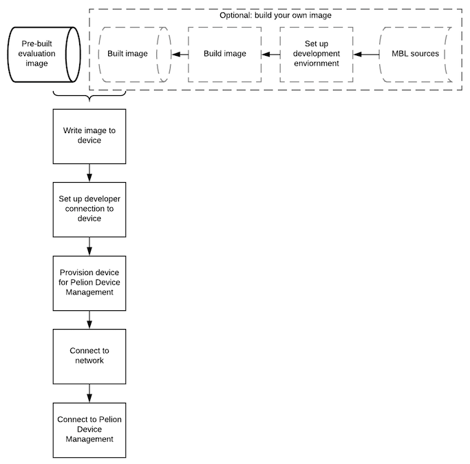

# Mbed Linux OS image types

MBL provides three types of images:

- **Evaluation image:** A pre-compiled image ready to be flashed on the supported targets. It is almost the same as a Development image.<!--how is it different?-->

- **Development image:** You need to build this image using the build-mbl tool. It contains packages, applications, and configurations suitable for the development of a product. To generate `mbl-image-development`, the DISTRO parameter is set to `mbl-development`.

- **Production image:** You need to build this image using the build-mbl tool. This image introduces configuration options that provide additional security protection to make the image suitable for production. To generate `mbl-image-production`, the DISTRO is set to `mbl-production`. This work is still in progress.

# Installing MBL on a new device

To install Mbed Linux OS on a new device:

1. Review our list of [supported development boards](../first-image/hardware.html) and set up your [development environment](../first-image/development-environment.html).
1. Get an MBL image. You can get a [prebuilt evaluation image](../first-image/downloading-an-evaluation-image.html), or [build your own](../first-image/building-a-developer-image.html).<!--note to self: fix link-->
1. [Write the image to the device](../first-image/writing-an-image-to-supported-boards.html).
1. Provision the device with [Pelion Device Management credentials and an API key](../first-image/provisioning-for-pelion-device-management.html) so that it can connect to your Device Management account.
1. [Set up your network connection](../first-image/connecting-to-a-network-and-pelion-device-management.html) and [test your Device Management connectivity](../first-image/verifying-that-the-device-is-connected-to-device-management.html).

