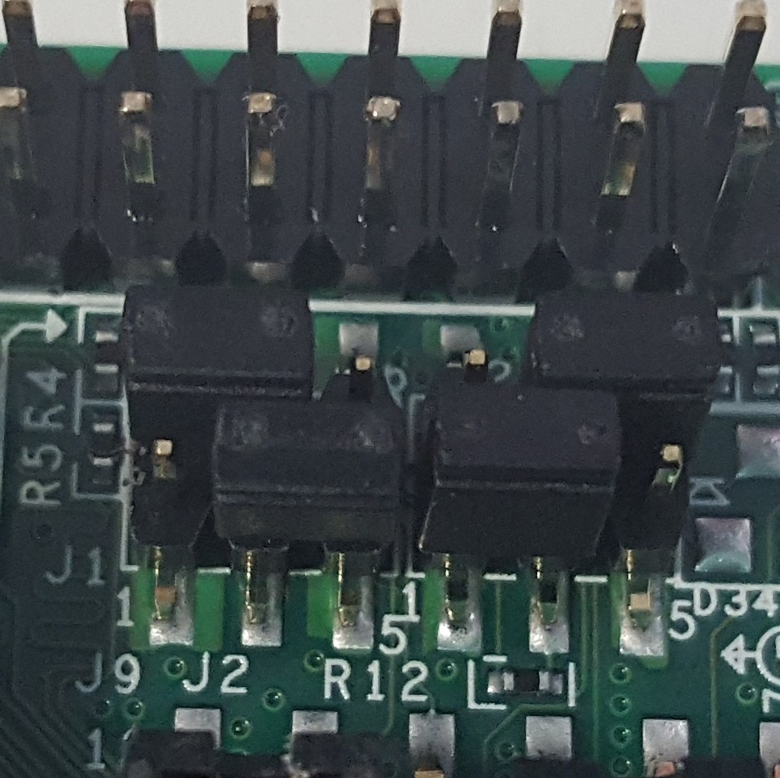
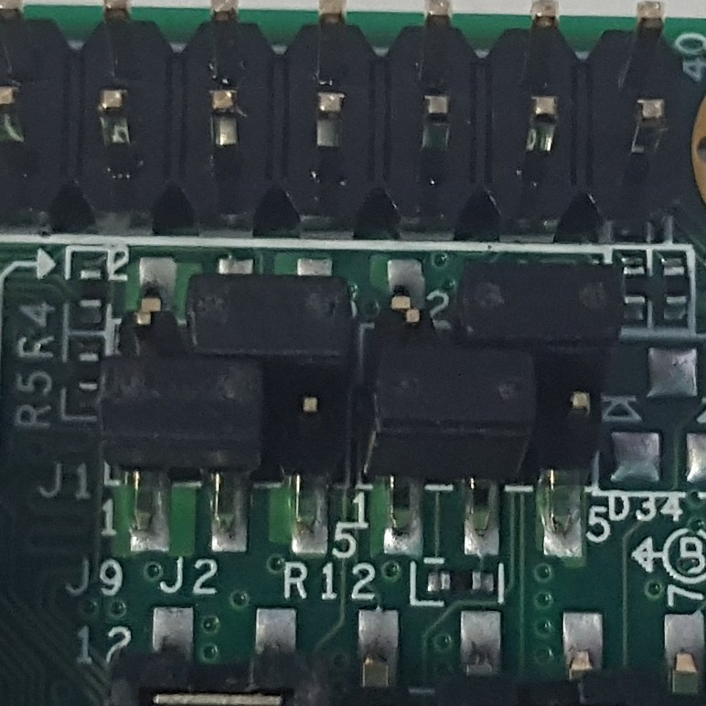

# PICO-PI baseboard with the PICO-IMX7D or PICO-IMX6UL SoM

There are two processes for writing to the PICO-PI:

* [Writing the first image](#writing-the-first-image).
* [Writing subsequent images](#writing-subsequent-images).

## Writing the first image

<span class="notes">This assumes you have already assembled your baseboard and SoM. These first-time instructions are distilled from [information from TechNexion](https://www.technexion.com/support/knowledgebase/loading-bootable-software-images-onto-the-emmc-of-picosom-on-pico-pi/). These instructions can also be used to recover the board if it cannot boot into u-boot.</span>

1. Check the current block storage devices on your PC:

    ```
    lsblk
    ```

    A list of devices displays. For example:

    ```
    NAME          MAJ:MIN RM   SIZE RO TYPE MOUNTPOINT
    sdb             8:16   0   1.8T  0 disk
    └─sdb1          8:17   0   1.8T  0 part /mnt/2tb-disk
    sr0            11:0    1  1024M  0 rom  
    sda             8:0    0 238.5G  0 disk
    ├─sda2          8:2    0   238G  0 part
    │ ├─vg00-swap 253:1    0   7.5G  0 lvm  [SWAP]
    │ └─vg00-root 253:0    0 230.6G  0 lvm  /
    └─sda1          8:1    0   476M  0 part /boot
    ```

   You'll need to refer to this output in the following steps, so save it for reference.

1. Set the PICO-PI to serial download mode by changing the boot configuration jumper settings (the exact setting depends on the System on Module (SoM) you are using).

| PICO-IMX7D | PICO-IMX6UL |
| ---------- | ----------- |
|  |  |

1. Connect both the PICO-PI USB-C socket and the micro-USB socket to your PC.

    You should now be able to see a USB TTY device, such as, `/dev/ttyUSB0`, on your PC.

1. Connect to the PICO-PI's console using a command such as:

    ```
    minicom -D /dev/ttyUSB0
    ```

    Use the following settings:

    * Baud rate: 115200.
    * Encdoing: [8N1](https://en.wikipedia.org/wiki/8-N-1).
    * No hardware flow control (enabled by default).

1. Download and unzip the TechNexion image loader software: [ftp://download.technexion.net/development_resources/development_tools/installer/pico-imx6-imx6ul-imx7_otg-installer_20171101.zip](ftp://download.technexion.net/development_resources/development_tools/installer/pico-imx6-imx6ul-imx7_otg-installer_20171101.zip)

1. Run the USB OTG (on the go) image loader, using the following commands on Linux:

   a. For SoM PICO-IMX7D:

    ```
    cd pico-imx6-imx6ul-imx7_otg-installer_20171101
    sudo linux/imx_usb pico-imx7d_bootbomb_20170112.imx
    ```

   b. For SoM PICO-IMX6UL:

    ```
    cd pico-imx6-imx6ul-imx7_otg-installer_20171101
    sudo linux/imx_usb pico-imx6ul_bootbomb_20160510.imx
    ```

   For both:

    <span class="notes">Make sure you run the command as root using sudo otherwise the `imx_usb` loader will report `main:Could not open device vid=0x... pid=0x... err=-3`</span>

    You should see output on the PC that ends with something similar to the following:

    ```
    loading binary file(pico-imx7d_bootbomb_20170112.imx) to 877ff400, skip=0, fsize=259c00 type=aa

    <<<2464768, 2464768 bytes>>>
    succeeded (status 0x88888888)
    jumping to 0x877ff400
    ```

    On the console output from the device, it should end with:

    ```
    [    1.107086] Mass Storage Function, version: 2009/09/11                   
    [    1.112243] LUN: removable file: (no medium)                                 
    [    1.124192] Number of LUNs=1                                                 
    [    1.631131] configfs-gadget gadget: high-speed config #1: c                  
    ```

1. On your PC, you can now see new storage devices:

    ```
    lsblk
    ```

    In this example, the PICO-PI is listed as `sdc` (the partitions on the device are also shown):

    ```
    NAME          MAJ:MIN RM   SIZE RO TYPE MOUNTPOINT
    sdb             8:16   0   1.8T  0 disk
    └─sdb1          8:17   0   1.8T  0 part /mnt/2tb-disk
    sr0            11:0    1  1024M  0 rom  
    sdc             8:32   1   7.3G  0 disk
    └─sdc1          8:33   1    39M  0 part /media/user01/61DB-E6FE
    sda             8:0    0 238.5G  0 disk
    ├─sda2          8:2    0   238G  0 part
    │ ├─vg00-swap 253:1    0   7.5G  0 lvm  [SWAP]
    │ └─vg00-root 253:0    0 230.6G  0 lvm  /
    └─sda1          8:1    0   476M  0 part /boot
    ```
    <span class="notes">In the commands below, replace `/dev/sdX` with the device file name for the device's USB mass storage _without_ a number at the end.</span>

1. Ensure that none of the PICO-PI's flash partitions are mounted (replace `/dev/sdX` as explained above):

    ```
    sudo umount /dev/sdX*
    ```

1. From a Linux prompt, write the disk image to the PICO-PI's USB mass storage - not a partition on it (replace `/dev/sdX` as explained above)::

   a. For SoM PICO-IMX7D:

    ```
    sudo bmaptool copy --nobmap /path/to/artifacts/machine/imx7d-pico-mbl/images/mbl-image-development/images/mbl-image-development-imx7d-pico-mbl.wic.gz /dev/sdX
    ```

   b. For SoM PICO-IMX6UL:

    ```
    sudo bmaptool copy --nobmap /path/to/artifacts/machine/imx7d-pico-mbl/images/mbl-image-development/images/mbl-image-development-imx7d-pico-mbl.wic.gz /dev/sdX
    ```

   For both: This action may take some time.

    <span class="tips">**Tip**: Use `--nobmap` for the initial flashing, to ensure your flash is set up correctly. On all subsequent flashings, you can use the `--bmap` option with a bmap file to speed up the process: `sudo bmaptool copy --bmap /path/to/artifacts/machine/imx7d-pico-mbl/images/mbl-image-development/images/mbl-image-development-imx7d-pico-mbl.wic.bmap /path/to/artifacts/machine/imx7d-pico-mbl/images/mbl-image-development/images/mbl-image-development-imx7d-pico-mbl.wic.gz /dev/sdX`</span>

1. When `bmaptool` has finished, eject the device:

    ```
    sudo eject /dev/sdX
    ```

1. Unplug both USB cables from the PICO-PI, and set the boot configuration jumper settings to boot from the on board EMMC flash, depending on the SoM you are using:

| PICO-IMX7D | PICO-IMX6UL |
| ---------- | ----------- |
|  |  |


1. Connect both the PICO-PI USB-C socket and the micro-USB socket back to your PC.

    The device now boots into MBL.

1. To log in to MBL, wait for a login prompt, and then enter the username `root`. You will not be prompted for a password.

## Writing subsequent images

1. Check the current block storage devices on your PC:

    ```
    lsblk
    ```

    A list of devices displays. For example:

    ```
    NAME          MAJ:MIN RM   SIZE RO TYPE MOUNTPOINT
    sdb             8:16   0   1.8T  0 disk
    └─sdb1          8:17   0   1.8T  0 part /mnt/2tb-disk
    sr0            11:0    1  1024M  0 rom  
    sda             8:0    0 238.5G  0 disk
    ├─sda2          8:2    0   238G  0 part
    │ ├─vg00-swap 253:1    0   7.5G  0 lvm  [SWAP]
    │ └─vg00-root 253:0    0 230.6G  0 lvm  /
    └─sda1          8:1    0   476M  0 part /boot
    ```

   You'll need to refer to this output in the following steps, so save it for reference.

1. Connect both the PICO-PI USB-C socket and the micro-USB socket to your PC.

   You should now be able to see a USB TTY device, such as, `/dev/ttyUSB0`, on your PC.

1. Connect to the PICO-PI's console using a command such as:

   ```
   minicom -D /dev/ttyUSB0
   ```

   Use the following settings:

   * Baud rate: 115200.
   * Encdoing: [8N1](https://en.wikipedia.org/wiki/8-N-1).
   * No hardware flow control (enabled by default).

1. If you got a U-boot prompt on the device, continue to the next step.

   If you got an operating system boot (for example, Android), reboot the device until you get a U-boot prompt, and then press any key to prevent the operating system from booting again. Continue to the next step.

1. To expose the board's flash device to Linux as USB mass storage, in the U-boot prompt, enter:

    ```
    ums 0 mmc 0
    ```

    On the device, you now see an ASCII-art "spinner".

1. On your PC, you can now see new storage devices:

    ```
    lsblk
    ```

    In this example, the PICO-PI is listed as `sdc` (the partitions on the device are also shown):

    ```
    NAME          MAJ:MIN RM   SIZE RO TYPE MOUNTPOINT
    sdb             8:16   0   1.8T  0 disk
    └─sdb1          8:17   0   1.8T  0 part /mnt/2tb-disk
    sr0            11:0    1  1024M  0 rom  
    sdc             8:32   1   7.3G  0 disk
    └─sdc1          8:33   1    39M  0 part /media/user01/61DB-E6FE
    sda             8:0    0 238.5G  0 disk
    ├─sda2          8:2    0   238G  0 part
    │ ├─vg00-swap 253:1    0   7.5G  0 lvm  [SWAP]
    │ └─vg00-root 253:0    0 230.6G  0 lvm  /
    └─sda1          8:1    0   476M  0 part /boot
    ```

    <span class="notes">In the commands below, replace `/dev/sdX` with the device file name for the device's USB mass storage _without_ a number at the end.</span>

1. Ensure that none of the PICO-PI's flash partitions are mounted (replace `/dev/sdX` as explained above):

    ```
    sudo umount /dev/sdX*
    ```

1. From a Linux prompt, write the disk image to the PICO-PI's USB mass storage - not a partition on it (replace `/dev/sdX` as explained above):

   a. For SoM PICO-IMX7D:

    ```
    sudo bmaptool copy --bmap /path/to/artifacts/machine/imx7d-pico-mbl/images/mbl-image-development/images/mbl-image-development-imx7d-pico-mbl.wic.bmap /path/to/artifacts/machine/imx7d-pico-mbl/images/mbl-image-development/images/mbl-image-development-imx7d-pico-mbl.wic.gz /dev/sdX
    ```

   b. For SoM PICO-IMX6UL:

    ```
    sudo bmaptool copy --bmap /path/to/artifacts/machine/imx6ul-pico-mbl/images/mbl-image-development/images/mbl-image-development-imx6ul-pico-mbl.wic.bmap /path/to/artifacts/machine/imx6ul-pico-mbl/images/mbl-image-development/images/mbl-image-development-imx6ul-pico-mbl.wic.gz /dev/sdX
    ```

   For both: This action may take some time.


1. When `bmaptool` has finished, eject the device:

    ```
    sudo eject /dev/sdX
    ```

1. On the device's U-boot prompt, press <kbd>Ctrl</kbd>-<kbd>C</kbd> to exit USB mass storage mode.
1. Reboot the device:

    ```
    reset
    ```

    The device now boots into MBL.

1. To log in to MBL, wait for a login prompt, and then enter the username `root`. You will not be prompted for a password.


***

Copyright © 2020 Arm Limited (or its affiliates)
