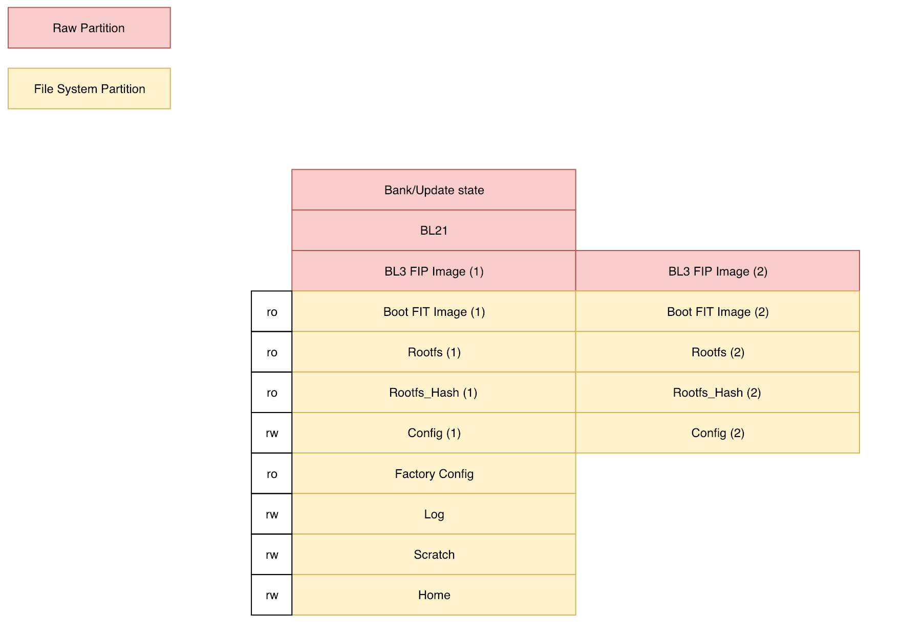

# Partition layout

## General information

MBL images contain two types of "partition":
1. Normal file system partitions that have entries in the partition table.
2. "Raw" partitions that don't have file systems and don't have entries in the
   partition table. A raw partition is used when it needs to be accessible to
   an early bootloader that does not have file system drivers.

The partition layout for every board includes at least the following partitions:

| Label              | ro/rw | Type | Mount point      | Default Size | Contains |
|--------------------|-------|------|------------------|--------------|----------|
| boot               | ro    | vfat | /boot            | 48MiB        | Kernel, device tree and U-Boot boot script |
| bootflags          | rw    | ext4 | /mnt/flags       | 20MiB        | Flags to determine which rootfs is active |
| rootfs1            | rw    | ext4 | /                | 500MiB       | Root filesystem bank 1 |
| rootfs2            | rw    | ext4 | /                | 500MiB       | Root filesystem bank 2 |
| factory\_config    | rw    | ext4 | /config/factory  | 20MiB        | Factory configuration |
| nfactory\_config1  | rw    | ext4 | /config/user     | 20MiB        | Non-factory config 1; user data configuration |
| nfactory\_config2  | rw    | ext4 | /config/user     | 20MiB        | Unused at this time |
| log                | rw    | ext4 | /var/log         | 128MiB       | Log files |
| scratch            | rw    | ext4 | /scratch         | 500MiB       | Temporary files (such as downloaded firmware files) |
| home               | rw    | ext4 | /home            | 450MiB       | User application storage |

Images also contain partitions for bootloaders, but the details are board specific.

Note that this partition layout does not match our future plans and will be changed in a future release.

## Board specific information

### Raspberry Pi 3

Full partition layout:

| Label/Name        | Size   | U-Boot iface dev:part | Linux device file | Notes    |
|-------------------|--------|-----------------------|-------------------|----------|
| BL3 FIP Image (1) | 4MiB   | -                     | -                 | Raw; FIP image containing TF-A BL3, OP-TEE and U-Boot |
| BL3 FIP Image (2) | 4MiB   | -                     | -                 | Raw; unused at this time |
| boot              | 48MiB  | mmc 0:1               | mmcblk0p1         | Primary  |
| bootflags         | 20MiB  | mmc 0:2               | mmcblk0p2         | Primary  |
| rootfs1           | 500MiB | mmc 0:3               | mmcblk0p3         | Primary  |
| -                 | -      | mmc 0:4               | mmcblk0p4         | Extended |
| rootfs2           | 500MiB | mmc 0:5               | mmcblk0p5         | Logical  |
| factory\_config   | 20MiB  | mmc 0:6               | mmcblk0p6         | Logical  |
| nfactory\_config1 | 20MiB  | mmc 0:7               | mmcblk0p7         | Logical  |
| nfactory\_config2 | 20MiB  | mmc 0:8               | mmcblk0p8         | Logical  |
| log               | 128MiB | mmc 0:9               | mmcblk0p9         | Logical  |
| scratch           | 500MiB | mmc 0:10              | mmcblk0p10        | Logical  |
| home              | 450MiB | mmc 0:11              | mmcblk0p11        | Logical  |

### WaRP7 and PICO-PI with IMX7D

Full partition layout:

| Label/Name        | Size   | U-Boot iface dev:part | Linux device file | Notes       |
|-------------------|--------|-----------------------|-------------------|-------------|
| BL2               | 1023KiB| -                     | -                 | Raw; TF-A BL2 |
| BL3 FIP Image (1) | 1024KiB| -                     | -                 | Raw; FIP image containing TF-A BL3, OP-TEE and U-Boot |
| BL3 FIP Image (2) | 1024KiB| -                     | -                 | Raw; unused at this time |
| boot              | 48MiB  | mmc 0:1               | mmcblk0p1         | Primary     |
| bootflags         | 20MiB  | mmc 0:2               | mmcblk0p2         | Primary     |
| rootfs1           | 500MiB | mmc 0:3               | mmcblk0p3         | Primary     |
| -                 | -      | mmc 0:4               | mmcblk0p4         | Extended    |
| rootfs2           | 500MiB | mmc 0:5               | mmcblk0p5         | Logical     |
| factory\_config   | 20MiB  | mmc 0:6               | mmcblk0p6         | Logical     |
| nfactory\_config1 | 20MiB  | mmc 0:7               | mmcblk0p7         | Logical     |
| nfactory\_config2 | 20MiB  | mmc 0:8               | mmcblk0p8         | Logical     |
| log               | 128MiB | mmc 0:9               | mmcblk0p9         | Logical     |
| scratch           | 500MiB | mmc 0:10              | mmcblk0p10        | Logical     |
| home              | 450MiB | mmc 0:11              | mmcblk0p11        | Logical     |

### NXP 8M Mini EVK

Full partition layout:

| Label/Name        | Size   | U-Boot iface dev:part | Linux device file | Notes       |
|-------------------|--------|-----------------------|-------------------|-------------|
| Bootloaders       | 1024KiB| -                     | -                 | Raw; TF-A BL2, TF-A BL3, OP-TEE and U-Boot |
| boot              | 48MiB  | mmc 0:1               | mmcblk1p1         | Primary     |
| bootflags         | 20MiB  | mmc 0:2               | mmcblk1p2         | Primary     |
| rootfs1           | 500MiB | mmc 0:3               | mmcblk1p3         | Primary     |
| -                 | -      | mmc 0:4               | mmcblk1p4         | Extended    |
| rootfs2           | 500MiB | mmc 0:5               | mmcblk1p5         | Logical     |
| factory\_config   | 20MiB  | mmc 0:6               | mmcblk1p6         | Logical     |
| nfactory\_config1 | 20MiB  | mmc 0:7               | mmcblk1p7         | Logical     |
| nfactory\_config2 | 20MiB  | mmc 0:8               | mmcblk1p8         | Logical     |
| log               | 128MiB | mmc 0:9               | mmcblk1p9         | Logical     |
| scratch           | 500MiB | mmc 0:10              | mmcblk1p10        | Logical     |
| home              | 450MiB | mmc 0:11              | mmcblk1p11        | Logical     |

## Notes on firmware update

To support firmware updates, MBL has storage for two separate root file systems and a mechanism to select which root file system to boot into after reboots.

A script inside the `initramfs` checks which root partition is currently active; by default this is `rootfs1`, but the script will change to `rootfs2` if a flag file called `rootfs2` is present in the `bootflags` partition.

## Future plans

The plan for the flash memory partition layout for MBL is driven by four high-level requirements:

* Use cases for device firmware update.
* Use cases for application management.
* Secure Boot and firmware verification.
* Use cases for device manufacturing.

In summary, requirements that influence the flash layout are:

| Requirement | Implication |
| --- | --- |
| It should be possible to update all device firmware except for early stage boot loaders. | Components that are loaded during boot need to start at a block number known by the loading boot loader. |
| A failure during the update process (such as a power loss) should not result in a bricked device.	| The previous known good version of a booted component should be maintained in flash until an updated version has been verified to be complete, authentic and viable. This means that all booted components should be banked to accommodate both the known good and the updated versions of a component. Writes to one bank of a component should not affect the other bank, and writes to any component should not affect any other components. Due to the nature of flash storage, this means that components should not share flash erase blocks with other components or other banks of the same component.|
| A multi-component update should either be applied in its entirety or not at all. A device should never be left in a state where only a partial update was performed. | Non-volatile state must be held that reflects the state that a multi-component update is in progress but is not yet complete. |
| A firmware update involving multiple components may extend across power failures. |	Non-volatile state must be held reflecting the presence of a component update. Only when all components are installed can the entire update be viewed as complete. |
| A multi-component update should be applied either in its entirety or not at all. A device should never be left in a state where only a partial update was performed. | A non-volatile state must be held, reflecting that a multi-component update is in progress but is not yet complete. |
| Data saved in flash memory that does not need to be modified in normal device operation should be write-protected. |	Some partitions should be created or modified to be read-only. Factory data written during the manufacturing process should be saved in a partition that is modified to read-only when a device boots after its life-cycle state has been modified to 'manufacture complete'. |
| A device should support the 'restore to factory' use case. | To allow the user configuration to be deleted without deleting the factory configuration, the two types of data should be kept separate. |

The planned layout is shown in the following diagram.

